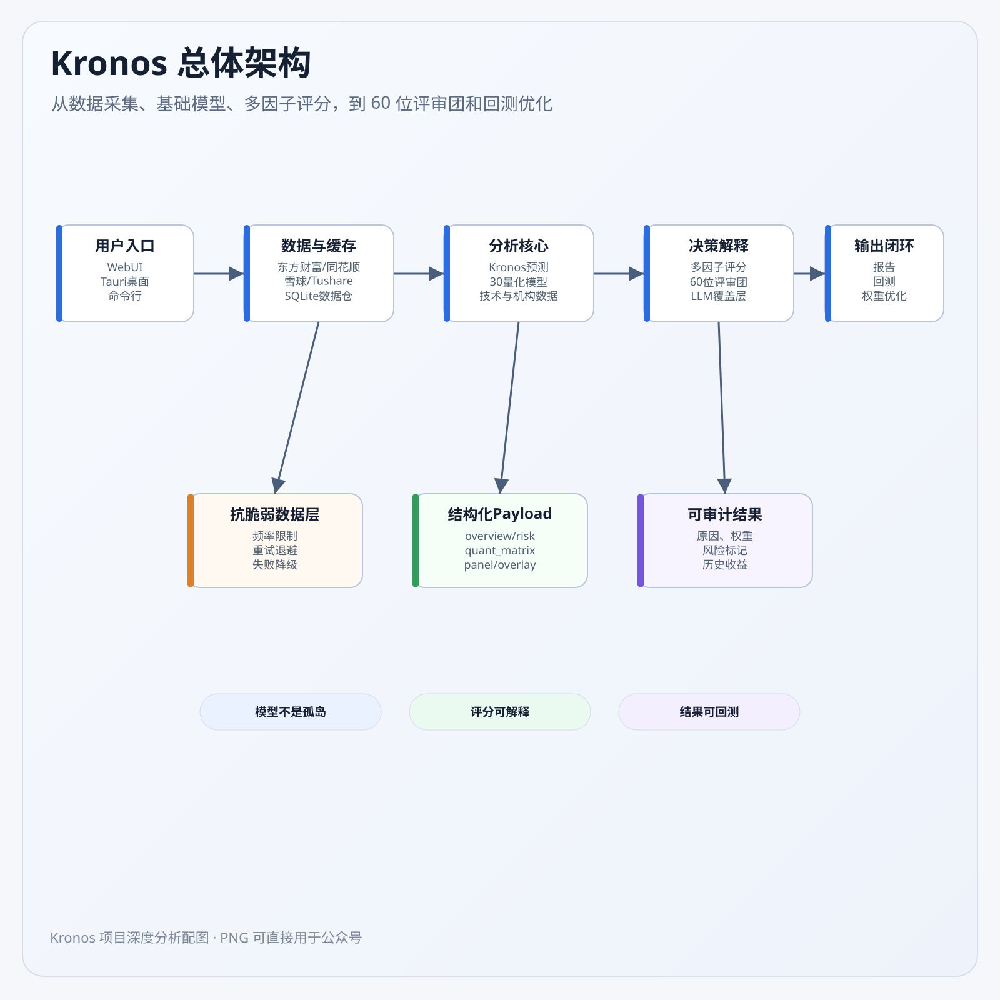
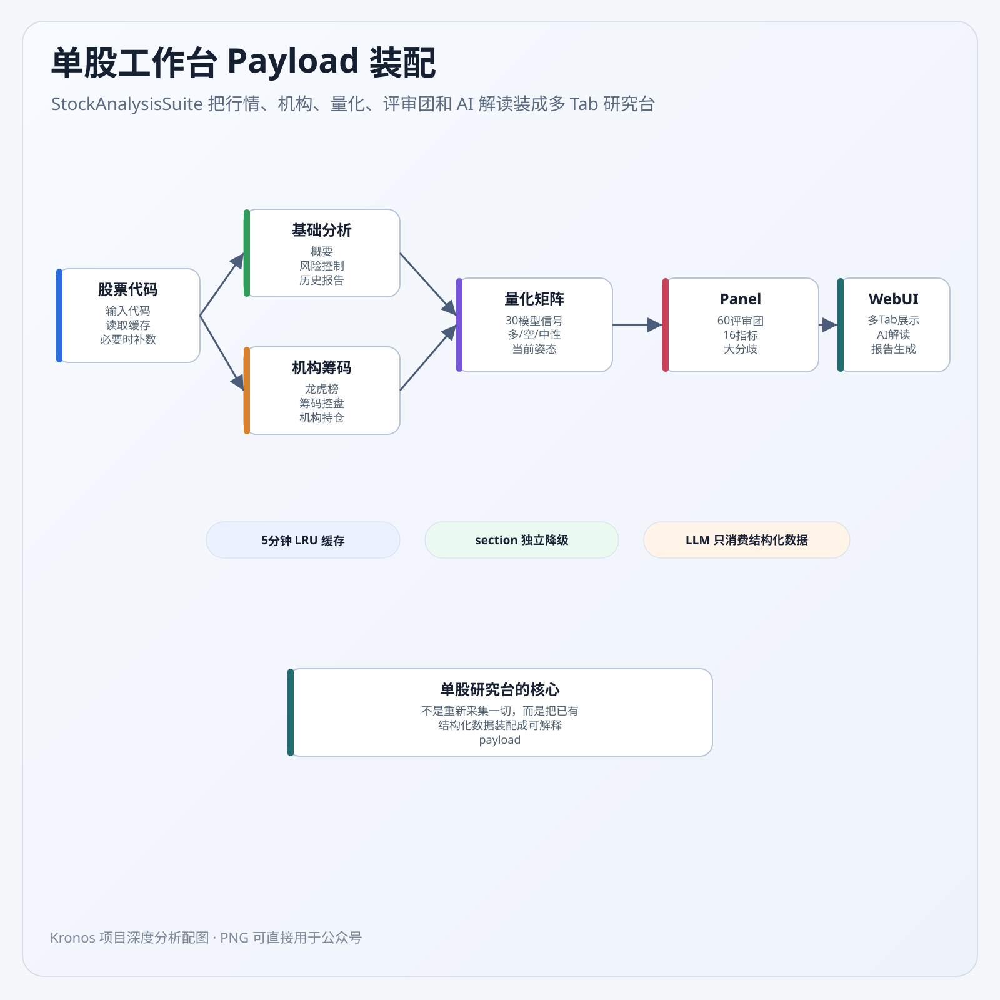

<div align="center">
  <h1><b>Kronos: A Foundation Model for the Language of Financial Markets</b></h1>
  <h3>金融 K 线基础模型 · 投资机会挖掘系统 · 本地智能投研控制台</h3>
</div>

<div align="center">

<a href="https://huggingface.co/NeoQuasar">

</a>
<a href="https://shiyu-coder.github.io/Kronos-demo/">  </a>
<a href="https://github.com/shiyu-coder/Kronos/graphs/commit-activity">

</a>
<a href="https://github.com/shiyu-coder/Kronos/stargazers">

</a>
<a href="https://github.com/shiyu-coder/Kronos/network/members">

</a>
<a href="./LICENSE">

</a>


</div>

<div align="center">
  <!-- 自动翻译链接 -->
  <a href="https://zdoc.app/de/shiyu-coder/Kronos">Deutsch</a> |
  <a href="https://zdoc.app/es/shiyu-coder/Kronos">Español</a> |
  <a href="https://zdoc.app/fr/shiyu-coder/Kronos">français</a> |
  <a href="https://zdoc.app/ja/shiyu-coder/Kronos">日本語</a> |
  <a href="https://zdoc.app/ko/shiyu-coder/Kronos">한국어</a> |
  <a href="https://zdoc.app/pt/shiyu-coder/Kronos">Português</a> |
  <a href="https://zdoc.app/ru/shiyu-coder/Kronos">Русский</a> |
  <a href="https://zdoc.app/zh/shiyu-coder/Kronos">中文</a>
</div>

<p align="center">
  
</p>

> Kronos 是**第一个开源金融 K 线（Candlestick）基础模型**，基于全球 **45+ 交易所**数据预训练。
> 在此基础上，本仓库进一步构建了面向 A 股的**投资机会挖掘引擎**与**本地智能投研控制台（Lumo Trade）**，
> 形成从"数据 → 预测 → 挖掘 → 评分 → 报告 → 回测"的完整闭环。

---

## 📰 News

* 🚩 **[2025.08.17]** 发布微调脚本（Finetuning），支持将 Kronos 适配到自定义任务。
* 🚩 **[2025.08.02]** 论文上线 [arXiv:2508.02739](https://arxiv.org/abs/2508.02739)。
* 🚩 **[2026.08]** 投资机会挖掘引擎迭代至 **v25 评分规则 + m1 标记体系**；桌面端 **Lumo Trade** 上线（15 页面 / 21 个个股分析页签）。

---

## 📜 Introduction

**Kronos** 是一个 decoder-only 基础模型家族，专门为金融市场的"语言"——K 线序列——而预训练。与通用时序基础模型（TSFM）不同，Kronos 专为金融数据高噪声、非平稳的特性设计，采用新颖的两阶段框架：

1. 专用 **Tokenizer** 将连续的、多维的 K 线数据（OHLCV）量化为**分层离散 token**（Binary Spherical Quantization, BSQuantizer）；
2. 大规模自回归 **Transformer** 在这些 token 上预训练，可作为统一模型服务于多种量化任务（预测下一根 K 线、特征表示等）。

<p align="center">
    
</p>

### 项目三层架构

Kronos 项目不是一个单一的"预测工具"，而是一个**三层结构**的完整系统：

```
┌────────────────────────────────────────────────────────────┐
│  第三层 · 应用与产品                                          │
│  · Tauri 2 桌面端 Lumo Trade：总览 / 大盘云图 / 风险机遇大屏 /  │
│    资金榜单 / 条件选股 / 模拟盘 / 星轨图谱 / 个股分析工作台        │
│  · Flask Web UI / 命令行 CLI / 报告抽屉                       │
├────────────────────────────────────────────────────────────┤
│  第二层 · 分析引擎（投资机会挖掘流水线）                        │
│  · 候选池构建 → 市场环境识别 → 多维度评分 → 共享规则奖惩 →        │
│    一票否决 → 软筛漏斗 → LLM 深度分析 → 报告入库 → 自动回测       │
│  · 30 个量化交易模型 / 20+ 技术指标 / 三维情绪分析              │
│  · 非官方渠道深度挖掘（v4，社交情报/供应链/招聘/资金异动）        │
├────────────────────────────────────────────────────────────┤
│  第一层 · 数据与模型底座                                       │
│  · Kronos 金融基础模型（Tokenizer + Transformer Predictor）   │
│  · 多源数据管道：Tushare / 东方财富 / 同花顺 / 雪球             │
│  · SQLite 数据仓库（kronos_data.sqlite，30+ 主题表）           │
└────────────────────────────────────────────────────────────┘
```

<div align="center">
  
  <br/>
  <em>Kronos 总体架构：从数据采集、基础模型、多因子评分，到 60 位评审团和回测优化</em>
</div>

**核心设计哲学**：系统最聪明的地方，恰恰是**没让 AI 直接荐股**——AI（LLM）只做"把因子解释成人话"的深度分析，真正的决策逻辑全部落在**可回测、可追溯、可审计**的规则与因子体系上。

---

## ✨ Live Demo

在线演示展示了 Kronos 对 **BTC/USDT** 交易对未来 24 小时的预测结果：

**👉 [访问在线 Demo](https://shiyu-coder.github.io/Kronos-demo/)**

---

## 📦 Model Zoo

我们发布了一系列不同规模的预训练模型，满足不同的算力与应用需求。所有模型均可从 Hugging Face Hub 获取。

| Model        | Tokenizer                                                                       | Context length | Param  | Open-source                                                               |
|--------------|---------------------------------------------------------------------------------|----------------|--------|---------------------------------------------------------------------------|
| Kronos-mini  | [Kronos-Tokenizer-2k](https://huggingface.co/NeoQuasar/Kronos-Tokenizer-2k)     | 2048           | 4.1M   | ✅ [NeoQuasar/Kronos-mini](https://huggingface.co/NeoQuasar/Kronos-mini)   |
| Kronos-small | [Kronos-Tokenizer-base](https://huggingface.co/NeoQuasar/Kronos-Tokenizer-base) | 512            | 24.7M  | ✅ [NeoQuasar/Kronos-small](https://huggingface.co/NeoQuasar/Kronos-small) |
| Kronos-base  | [Kronos-Tokenizer-base](https://huggingface.co/NeoQuasar/Kronos-Tokenizer-base) | 512            | 102.3M | ✅ [NeoQuasar/Kronos-base](https://huggingface.co/NeoQuasar/Kronos-base)   |
| Kronos-large | [Kronos-Tokenizer-base](https://huggingface.co/NeoQuasar/Kronos-Tokenizer-base) | 512            | 499.2M | ❌                                                                         |

---

## 🚀 Quick Deployment (一键部署)

我们提供了完整的傻瓜式部署系统，支持 Windows、macOS / Linux 的一键安装和配置（Python 3.11+ 自动选择、依赖安装、环境检测）。

### Windows 用户

```powershell
# 以管理员身份运行 PowerShell，在项目根目录执行
.\quick_start.ps1
# 或直接双击
quick_start.bat
```

### macOS / Linux 用户

```bash
# 下载项目后，在项目根目录运行
chmod +x quick_start.sh
./quick_start.sh
```

### 部署后配置

1. **配置 Tushare API Token**（用于获取中国股市数据）：

   ```bash
   python scripts/setup_tushare.py
   ```

2. **检查环境配置**：

   ```bash
   python scripts/check_environment.py
   ```

3. **获取股票数据**：

   ```bash
   # 获取单只股票数据
   python scripts/fetch_data.py --symbol 600977 --start_date 2023-01-01 --end_date 2024-01-01

   # 批量获取多只股票数据（自动多源回退）
   python scripts/batch_fetch_enhanced.py --symbols 600977,000001,000002 --period 5m --min-days 365
   ```

4. **运行预测**：

   ```bash
   python scripts/run_prediction.py --data_file ./data/XSHG_5min_600977.csv
   ```

### 目录结构

```
Kronos/
├── model/                       # Kronos 基础模型
│   └── kronos.py                #   KronosTokenizer / Kronos / KronosPredictor
├── analysis/                    # 分析引擎核心（60+ 模块）
│   ├── opportunity_scorer.py    #   九维度多因子评分（游资思维 v4.0）
│   ├── scoring_rules.py         #   v25 共享评分规则（sim/live 统一）
│   ├── outcome_markers.py       #   m1 标记体系（暴涨/暴跌共性、体质分层）
│   ├── technical_analysis.py    #   20+ 技术指标 + 30 量化模型
│   └── ...                      #   市场环境、情绪、资金、新闻、LLM 服务等
├── scripts/                     # 部署和工具脚本
│   ├── run_opportunity_discovery.py  # 投资机会挖掘主程序（六阶段流水线）
│   ├── fetch_data.py            #   数据获取（Tushare / 爬虫 / 自动多源）
│   ├── batch_fetch.py / batch_fetch_enhanced.py
│   ├── check_environment.py / setup_tushare.py / config_wizard.py
│   └── *_crawler.py             #   东财 / 同花顺 / 雪球爬虫
├── config/                      # 配置文件（crawler_config.json / tushare_config.json）
├── data_store/                  # SQLite 数据层（30+ 主题仓库）
├── data/                        # 数据存储目录
├── examples/                    # 预测 / 批量预测 / 机会挖掘示例
├── finetune/                    # 微调流水线（Qlib）
├── webui/                       # Flask / Robyn Web UI
├── desktop/                     # Tauri 桌面端前端（Lumo Trade）
├── docs/                        # 完整文档体系（含架构配图）
├── assets/ / figures/           # 图标与示意图
└── requirements.txt             # Python 依赖
```

### 常见问题

**Q: 如何获取 Tushare Token？**
A: 访问 [Tushare 官网](https://tushare.pro/register?reg=7) 注册账号并获取免费 Token。

**Q: 数据格式是什么？**
A: 数据自动保存为 CSV 格式，包含 `timestamps, open, high, low, close, volume, amount` 列（volume/amount 可缺省，自动补零）。

**Q: 支持哪些股票市场？**
A: 中国 A 股市场通过 Tushare / 爬虫获取；其他市场的 CSV 数据可直接放入 `./data/` 使用。

---

## 📈 投资机会挖掘（核心能力）

Kronos 项目在本仓库中的核心价值，不只是"预测下一根 K 线"，而是构建了一条完整的**投资机会挖掘流水线**（`scripts/run_opportunity_discovery.py`），目标是**"在信息公开前捕捉投资机会"**，并且"捕捉得准、解释得清、验证得了"。

### 六阶段流水线

```
阶段 0   大盘环境评估（regime）→ 报告中提示"当前是否值得入场"
   │
阶段 1   候选池构建（五路多源融合）
   │     · 热股 TOP100（东方财富人气榜）
   │     · 热门板块成分股（东财 push2 实时 / Tushare 兜底）
   │     · 超跌反弹筛选（10日跌≥8% + 反转信号）
   │     · 个股资金流向（主力净流入/流出前 20）
   │     · 低位放量待突破扫描
   │     去重合并 + ST/退市过滤 + 热榜深位排名裁剪
   │
阶段 2   多维度打分（并发 10 线程，单股超时 60s）
   │     · 9 大维度评分 + v25 共享规则奖惩 + 一票否决
   │     · 动态权重模板：底部启动 / 趋势接力 / 消息驱动 / 基础
   │
阶段 3   漏斗筛选（v8.0 起：不淘汰，只标记风险）
   │
阶段 4   报表生成（HTML + CSV + Excel；可运行元信息追溯）
   │
阶段 5   结果入库 + 自动回测（保存推荐 → 回填 30 日收益 → 回测报告）
   │
阶段 6   资源清理（scorer / HTTP Session，带超时保护）
```

### 九大评分维度与 v25 规则

`analysis/opportunity_scorer.py` 是评分核心（"投资机会多维度打分系统 v4.0 - 游资思维重构版"），九大维度动态加权：

| 维度 | 权重 | 说明 |
|------|------|------|
| 量化模型 | 0.30 | 30 个量化模型的买入信号质量与稀缺性 |
| 量价健康 | 0.24 | 量价结构验证主力行为 |
| 技术面 | 0.12 | 20+ 技术指标共振 + 入场时机 |
| 位置时机 | 0.12 | 追高风险的反向指标 |
| 板块 | 0.08 | 板块强度与热度 |
| 龙虎榜 | 0.06 | 龙虎榜资金行为 |
| 流动性 | 0.05 | 成交额/换手率 |
| 基本面 | 0.03 | 财务与估值（短线场景权重低） |
| 事件/情绪 | 0.00 | v21 起归零（回测证明无贡献） |

`analysis/scoring_rules.py` 实现了 **v25 共享评分规则**（`RULESET_VERSION='v25'`），把回测（sim）与生产（live）两套评分统一到同一规则源，杜绝规则漂移。核心发现（1487 行有效样本回测驱动）：

- **量化分存在反转效应**：量化 90+ 收益 -4.29% vs 0-50 收益 +4.03% → `qs_95_pen` 罚 18；
- **低卖出信号是最强正向因子**：卖出信号 0-1 组收益 +3.26%（胜率 52.9%）→ `sell0_bonus` / `sell0_zt_bonus`；
- **RSI 85+ 是最强负向因子**：5 日收益 -7.33% → `rsi_extreme_pen` 罚 25；
- **3 日涨幅 ≥15% 后 5 日收益 -4.99%**（胜率仅 18.6%），强力过滤。

### 入选后表现回溯（m1 标记体系）

`analysis/outcome_markers.py` 对 1896 条有效样本（1100 只个股 / 121 个入选日）做入选后表现回溯，得到**与总分正交**的七枚标记：

| 标记 | 规则 | 10 日均值 | 暴涨率 | 暴跌率 |
|------|------|-----------|--------|--------|
| 🚀 爆发基因 | 技术分≥60 且 板块分<55 | -0.37% | **8.4%** | 8.1% |
| ✅ 零卖压 | 卖出信号=0 | **+0.26%** | 6.0% | 6.0% |
| 🔥 板块过热 | 板块分≥95 | -6.75% | — | 25.2% |
| ⚠️ 追高透支 | 追高≥80 | -4.30% | — | 24.5% |
| 📈 超买风险 | RSI≥75 | -4.84% | — | 22.2% |
| 🔻 卖压聚集 | 卖出信号≥4 | -4.27% | — | 19.7% |
| 📉 技术乏力 | 技术分<45 | -3.80% | — | 15.8% |

**体质分层完全单调**：净标记数 ≥+2（爆发体质）10 日均值 +2.63%；≤-3（高危体质）-6.03% / 暴跌率 27.5%。

### 打分体系全流程（可视化）

<div align="center">
  
  <br/>
  <em>多因子打分系统全流程：从候选池到 S 级推荐</em>
</div>

<p align="center">
  
  
</p>

**v25 关键回测发现（可视化）**：

<p align="center">
  
  
</p>
<p align="center">
  <em>左：量化分存在反转效应（90+ 收益 -4.29% vs 0-50 收益 +4.03%）；右：RSI 85+ 是最强负向因子（5 日收益 -7.33%）</em>
</p>

### LLM 深度分析与报告

- **LLM 深度分析**（阶段 3.5）：对高分股（≥65 分）做 LLM 解读（通义千问 / DeepSeek），并发自适应（2-5）、数量自适应（Top8-10）动态控制成本；
- **入选原因可追溯**：每个推荐都按信号强度优先级拼接"为什么入选"（热点关联新闻 → 主力净流入 → 底部放量 → 强模型名 → 业绩高增长 → 兜底逻辑）；
- **报告体系**：HTML（现代渐变、可视化卡片、可排序排名表）+ Markdown / CSV / Excel 多格式导出，`run_meta` 记录运行时间、来源、规则版本（`RULESET_VERSION`）与配置哈希（`config_hash`），保证可追溯。

### 运行机会挖掘

```bash
# 运行完整的机会挖掘流水线（推荐）
python scripts/run_opportunity_discovery.py --source multi --limit 100

# 指定候选来源（热度榜 / 资金流向榜 / 热门板块）
python scripts/run_opportunity_discovery.py --source heat
python scripts/run_opportunity_discovery.py --source moneyflow_dc
python scripts/run_opportunity_discovery.py --source sector_hot

# 并发线程数（默认 10）
python scripts/run_opportunity_discovery.py --workers 10

# 运行结束后按回测结果自动改写评分配置（默认关闭）
python scripts/run_opportunity_discovery.py --enable-auto-optimize
```

> **说明**：为保证热股数据总是最新，系统已默认禁用热门股票缓存并强制实时采集（`KRONOS_DISABLE_HOT_CACHE=1` 可全局生效）。

---

## 🔧 Finetuning on Your Own Data (A-Share Market Example)

我们提供了完整的微调流水线，演示如何用 [Qlib](https://github.com/microsoft/qlib) 处理 A 股数据并进行简单回测。

> **Disclaimer:** 该流水线用于演示微调过程，是简化示例，并非生产级量化交易系统。稳健的量化策略需要组合优化、风险因子中性化等更复杂的技术。

微调过程分为四步：

1. **Configuration**：设置路径与超参数（`finetune/config.py`）。
2. **Data Preparation**：用 Qlib 处理与切分数据。
3. **Model Finetuning**：微调 Tokenizer 与 Predictor。
4. **Backtesting**：评估微调后的模型。

### Prerequisites

```shell
pip install -r requirements.txt
pip install pyqlib
```

并按 [官方 Qlib 指南](https://github.com/microsoft/qlib) 准备本地日频数据。

### Step 1: 配置实验

修改 `finetune/config.py` 中的路径：

- `qlib_data_path`、`dataset_path`、`save_path`、`backtest_result_path`
- `pretrained_tokenizer_path`、`pretrained_predictor_path`（本地路径或 Hugging Face 模型名）

### Step 2: 准备数据集

```shell
python finetune/qlib_data_preprocess.py
```

### Step 3: 运行微调

```shell
# 微调 Tokenizer
torchrun --standalone --nproc_per_node=NUM_GPUS finetune/train_tokenizer.py

# 微调 Predictor
torchrun --standalone --nproc_per_node=NUM_GPUS finetune/train_predictor.py
```

### Step 4: 回测评估

```shell
# 指定推理 GPU
python finetune/qlib_test.py --device cuda:0
```

<p align="center">
    
</p>

> **📝 AI-Generated Comments**: `finetune/` 目录中的许多代码注释由 AI 助手（Gemini 2.5 Pro）生成，仅供参考，请以代码本身为准。

---

## 🕷️ 多源数据爬虫系统

Kronos 集成了基于 Playwright 的多数据源爬虫系统，支持从东方财富、同花顺、雪球等主流金融网站获取实时股票数据，具备**多源自动切换**与**智能反爬虫**能力。

### 主要特性

- **多数据源**: 东方财富 / 同花顺 / 雪球 + Tushare API
- **多源自动回退**: 某数据源返回 0 数据时自动尝试下一源（Tushare → 东财 → 同花顺 → 雪球），大幅提升采集成功率
- **反爬虫机制**: 随机延时、用户代理轮换、IP 代理支持、请求频率控制
- **浏览器管理**: Playwright 自动化浏览器启动、管理与资源清理
- **数据格式统一**: 自动转换为 Kronos 兼容格式（`{EXCHANGE}_{PERIOD}_{CODE}.csv`）

### 安装依赖

```bash
pip install playwright
playwright install chromium
```

### 配置

配置文件位于 `config/crawler_config.json`，包含 `general`（重试/超时/并发/频率限制）、`playwright`（浏览器参数）、`anti_crawler`（反爬参数）等。

### 使用方法

```bash
# Tushare 数据源
python scripts/fetch_data.py --symbol 000001.SZ --start-date 2024-01-01 --end-date 2024-12-31 --source tushare

# 爬虫数据源（自动多源切换）
python scripts/fetch_data.py --symbol 000001 --source eastmoney

# 自动多源（推荐）：逐个尝试直到成功
python scripts/fetch_data.py --symbol 000001 --source auto

# 列出可用数据源
python scripts/fetch_data.py --list-sources
```

批量采集（自动分批克服 2000 条 API 限制）：

```bash
python scripts/batch_fetch_enhanced.py --symbols 600977,000001,000002 --source auto --period 5m --min-days 365
```

### 数据健壮性

- **指数退避重试**（`analysis/retry_utils.py`）：防雷群效应 + 多源回退 + 数据质量验证（行数/字段）+ 缺失字段自动填充
- **代理交替重试**：默认路由 ↔ 直连绕过代理交替，覆盖"代理坏/直连坏"两种网络环境
- **单股超时**（`KRONOS_STOCK_TIMEOUT` 默认 60s）防止卡死；资源清理带超时保护

---

## 👨‍💻 快速上手：预测 (Getting Started)

### Manual Installation

1. Install Python 3.11+, and then install the dependencies:

```shell
pip install -r requirements.txt
```

### 📈 Making Forecasts

使用 `KronosPredictor` 类即可完成预测。它内置数据预处理、归一化、预测与反归一化，几行代码即可从原始数据到预测结果。

**Important Note**: `Kronos-small` / `Kronos-base` 的 `max_context` 为 **512**。推荐输入数据长度（`lookback`）不超过该值；`KronosPredictor` 会自动处理超长截断。

#### 1. Load the Tokenizer and Model

```python
from model import Kronos, KronosTokenizer, KronosPredictor

# Load from Hugging Face Hub
tokenizer = KronosTokenizer.from_pretrained("northwind9898/Kronos-Tokenizer-base")
model = Kronos.from_pretrained("northwind9898/Kronos-small")
```

#### 2. Instantiate the Predictor

```python
predictor = KronosPredictor(model, tokenizer, device="cuda:0", max_context=512)
```

#### 3. Prepare Input Data

`predict` 方法需要三个主要输入：历史 K 线 `df`（含 `['open','high','low','close']`，`volume`/`amount` 可选）、历史时间戳 `x_timestamp`、未来时间戳 `y_timestamp`。

```python
import pandas as pd

df = pd.read_csv("./data/XSHG_5min_600977.csv")
df['timestamps'] = pd.to_datetime(df['timestamps'])

lookback = 400
pred_len = 120

x_df = df.loc[:lookback-1, ['open', 'high', 'low', 'close', 'volume', 'amount']]
x_timestamp = df.loc[:lookback-1, 'timestamps']
y_timestamp = df.loc[lookback:lookback+pred_len-1, 'timestamps']
```

#### 4. Generate Forecasts

```python
pred_df = predictor.predict(
    df=x_df,
    x_timestamp=x_timestamp,
    y_timestamp=y_timestamp,
    pred_len=pred_len,
    T=1.0,          # Temperature for sampling
    top_p=0.9,      # Nucleus sampling probability
    sample_count=1  # Number of forecast paths to generate and average
)

print("Forecasted Data Head:")
print(pred_df.head())
```

**批量预测**（多只股票并行，各序列独立归一化）：

```python
pred_df_list = predictor.predict_batch(
    df_list=[df1, df2, df3],
    x_timestamp_list=[x_ts1, x_ts2, x_ts3],
    y_timestamp_list=[y_ts1, y_ts2, y_ts3],
    pred_len=pred_len,
    T=1.0, top_p=0.9, sample_count=1, verbose=True
)
```

**批量预测要求**：所有序列的 lookback 长度与 `pred_len` 必须一致；每份 DataFrame 需含 `['open','high','low','close']` 列。

#### 5. Example and Visualization

完整可运行示例见 [`examples/prediction_example.py`](examples/prediction_example.py)（无成交量版本见 `examples/prediction_wo_vol_example.py`），运行后将生成预测对比图：

<p align="center">
    
</p>

---

## 🖥️ Web UI 与桌面端（Lumo Trade）

### Web UI

```bash
cd webui
python run.py
# 或 ./start.sh
```

Web UI 提供：模型选择与加载、实时行情可视化、预测生成与绘图、结果导出。

### Lumo Trade 桌面端

项目基于 **Tauri 2** 构建了本地智能投研控制台 **Lumo Trade**，把"观察市场 → 发现机会 → 研究个股 → 识别风险 → 模拟执行 → 跟踪复盘"放在同一套桌面工作流中。后端即本仓库（Flask/Robyn API + SQLite 数据仓），桌面端保持本地化运行。

**基础数字**：15 个桌面页面 · 21 个个股分析页签 · 117 个后端 API 路由 · 30 个量化模型 · 109 个自动化测试文件。

<div align="center">
  
  <br/>
  <em>投研六步链路：市场全景 → 候选池 → 分层评分 → 个股深研 → 风控决策 → 沉淀复盘</em>
</div>

<div align="center">
  
  <br/>
  <em>Lumo Trade 五层技术架构</em>
</div>

主要功能页面：

| 页面 | 职责 |
|------|------|
| 总览 | 市场指标、热门榜单、实时异动、个股快搜 |
| 大盘云图 | 全市场热力图（指数状态 + 涨跌家数） |
| 风险·机遇大屏 | 机会分 × 市场风险 × 板块拥挤 × 个股/持仓风险同屏决策 |
| 资金榜单 | 主力净流入榜 + 量化温度计 / 吸筹榜 |
| 股指期货 | 期货行情、多空摘要、会员净持仓榜 |
| 条件选股 | 行情 × 资金 × 盘口 × 龙虎榜 × 技术形态 × 量化信号 8 维 AND 交集 |
| 分析工作台 | 机会挖掘表单 + K 线 + 量化摘要 + 任务 + 热点 |
| 个股工作台 | **21 个分析页签**：综合总览 / 主力深度 / 量化矩阵 / 筹码·控盘雷达 / 机构持仓 / 多空评审团 / AI 解读等 |
| 形态搜股 | 手绘曲线 + Pearson 相似度（≥0.85）检索历史相似形态后的前向收益 |
| 模拟盘 | 本地模拟台账：买入方式 / 持有周期 / 胜率验证 |
| 星轨图谱 | 主题 × 板块 × 个股的同心轨道拓扑 |
| 报告库 | 报告历史 + 模块健康 / 评分健康度 |

### 个股工作台 Payload 装配

<div align="center">
  
  <br/>
  <em>StockAnalysisSuite 把行情、机构、量化、评审团和 AI 解读装成多 Tab 研究台</em>
</div>

---

## 📚 文档体系

| 文档 | 说明 |
|------|------|
| [docs/00_文档导航索引.md](docs/00_文档导航索引.md) | 全项目文档导航 |
| [docs/01_投资机会挖掘系统完整文档.md](docs/01_投资机会挖掘系统完整文档.md) | 机会挖掘系统功能与架构（4297 行） |
| [docs/02_数据采集爬虫系统文档.md](docs/02_数据采集爬虫系统文档.md) | 爬虫与数据管道（1979 行） |
| [docs/03_系统架构技术文档.md](docs/03_系统架构技术文档.md) | 系统总体架构（4199 行） |
| [docs/04_因子打分体系与回测优化完整技术文档.md](docs/04_因子打分体系与回测优化完整技术文档.md) | 打分系统完整技术细节（含 14 张图） |
| [docs/入选后表现回溯-暴涨暴跌共性-20260729.md](docs/入选后表现回溯-暴涨暴跌共性-20260729.md) | m1 标记体系回溯报告 |
| [docs/wechat/lumo-trade-desktop-complete-guide.md](docs/wechat/lumo-trade-desktop-complete-guide.md) | Lumo Trade 桌面端完整指南 |
| [CLAUDE.md](CLAUDE.md) | AI 编程助手开发指南 |

---

## 💖 支持本项目 (Sponsor)

如果你觉得 Kronos 对你有帮助，欢迎通过微信扫码赞助，支持项目的持续开发与维护。你的每一份支持都是项目前进的动力 🙏

<div align="center">
  
  <br/>
  <em>推荐使用微信支付扫码赞助</em>
</div>

---

## 📖 Citation

If you use Kronos in your research, we would appreciate a citation to our [paper](https://arxiv.org/abs/2508.02739):

```
@misc{shi2025kronos,
      title={Kronos: A Foundation Model for the Language of Financial Markets},
      author={Yu Shi and Zongliang Fu and Shuo Chen and Bohan Zhao and Wei Xu and Changshui Zhang and Jian Li},
      year={2025},
      eprint={2508.02739},
      archivePrefix={arXiv},
      primaryClass={q-fin.ST},
      url={https://arxiv.org/abs/2508.02739},
}
```

---

## 📜 License

This project is licensed under the [MIT License](./LICENSE).

Copyright (c) 2025 ShiYu. See [LICENSE](LICENSE) for full text.

---

## ⚠️ 免责声明

本项目所有分析、预测与报告**仅供技术研究与学习参考，不构成任何投资建议**。金融投资有风险，入市需谨慎。项目中的历史收益数据部分来自项目自述报告，未经独立验证；投资者应独立决策并自行承担风险。