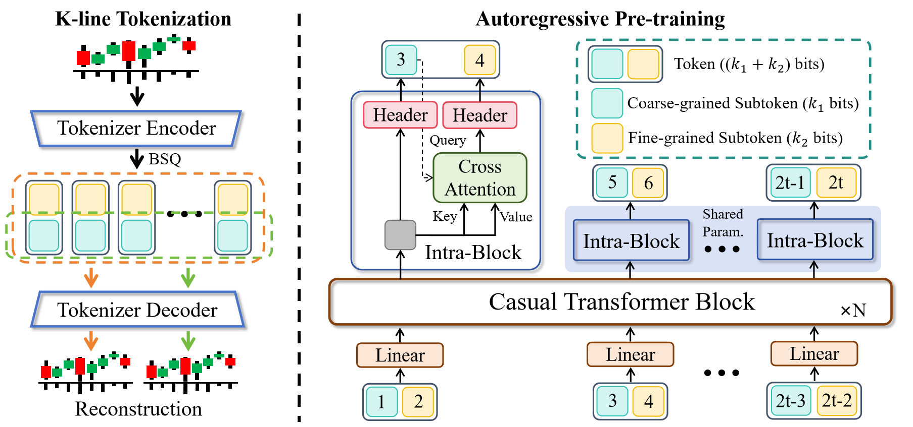
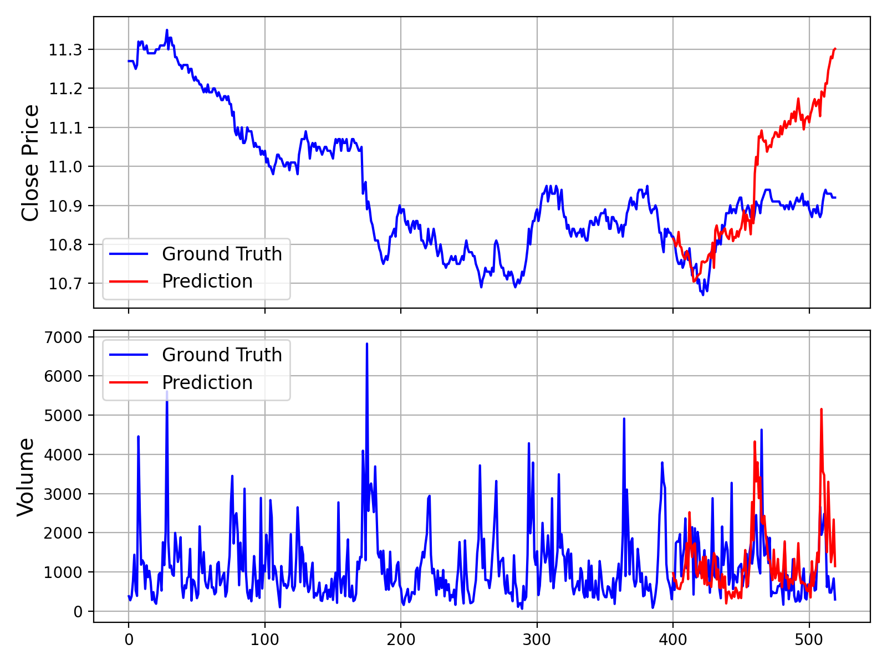

<div align="center">
  <h2><b>Kronos: A Foundation Model for the Language of Financial Markets </b></h2>
</div>


<div align="center">

</a> 
<a href="https://huggingface.co/NeoQuasar"> 
 
</a> 
<a href="https://shiyu-coder.github.io/Kronos-demo/">  </a>
<a href="https://github.com/shiyu-coder/Kronos/graphs/commit-activity"> 
 
</a> 
<a href="https://github.com/shiyu-coder/Kronos/stargazers"> 
 
</a> 
<a href="https://github.com/shiyu-coder/Kronos/network/members"> 
 
</a> 
<a href="./LICENSE"> 
 
</a>

</div>

<div align="center">
  <!-- Keep these links. Translations will automatically update with the README. -->
  <a href="https://zdoc.app/de/shiyu-coder/Kronos">Deutsch</a> | 
  <a href="https://zdoc.app/es/shiyu-coder/Kronos">Español</a> | 
  <a href="https://zdoc.app/fr/shiyu-coder/Kronos">français</a> | 
  <a href="https://zdoc.app/ja/shiyu-coder/Kronos">日本語</a> | 
  <a href="https://zdoc.app/ko/shiyu-coder/Kronos">한국어</a> | 
  <a href="https://zdoc.app/pt/shiyu-coder/Kronos">Português</a> | 
  <a href="https://zdoc.app/ru/shiyu-coder/Kronos">Русский</a> | 
  <a href="https://zdoc.app/zh/shiyu-coder/Kronos">中文</a>
</div>

<p align="center">


</p>

> Kronos is the **first open-source foundation model** for financial candlesticks (K-lines),
> trained on data from over **45 global exchanges**.


</div>

## 📰 News

* 🚩 **[2025.08.17]** We have released the scripts for fine-tuning! Check them out to adapt Kronos to your own tasks.
* 🚩 **[2025.08.02]** Our paper is now available on [arXiv](https://arxiv.org/abs/2508.02739)!

<p align="center">

## 📜 Introduction

**Kronos** is a family of decoder-only foundation models, pre-trained specifically for the "language" of financial
markets—K-line sequences. Unlike general-purpose TSFMs, Kronos is designed to handle the unique, high-noise
characteristics of financial data. It leverages a novel two-stage framework:

1. A specialized tokenizer first quantizes continuous, multi-dimensional K-line data (OHLCV) into **hierarchical
   discrete tokens**.
2. A large, autoregressive Transformer is then pre-trained on these tokens, enabling it to serve as a unified model for
   diverse quantitative tasks.

<p align="center">
    
</p>

## ✨ Live Demo

We have set up a live demo to visualize Kronos's forecasting results. The webpage showcases a forecast for the *
*BTC/USDT** trading pair over the next 24 hours.

**👉 [Access the Live Demo Here](https://shiyu-coder.github.io/Kronos-demo/)**

## 📦 Model Zoo

We release a family of pre-trained models with varying capacities to suit different computational and application needs.
All models are readily accessible from the Hugging Face Hub.

| Model        | Tokenizer                                                                       | Context length | Param  | Open-source                                                               |
|--------------|---------------------------------------------------------------------------------|----------------|--------|---------------------------------------------------------------------------|
| Kronos-mini  | [Kronos-Tokenizer-2k](https://huggingface.co/NeoQuasar/Kronos-Tokenizer-2k)     | 2048           | 4.1M   | ✅ [NeoQuasar/Kronos-mini](https://huggingface.co/NeoQuasar/Kronos-mini)   |
| Kronos-small | [Kronos-Tokenizer-base](https://huggingface.co/NeoQuasar/Kronos-Tokenizer-base) | 512            | 24.7M  | ✅ [NeoQuasar/Kronos-small](https://huggingface.co/NeoQuasar/Kronos-small) |
| Kronos-base  | [Kronos-Tokenizer-base](https://huggingface.co/NeoQuasar/Kronos-Tokenizer-base) | 512            | 102.3M | ✅ [NeoQuasar/Kronos-base](https://huggingface.co/NeoQuasar/Kronos-base)   |
| Kronos-large | [Kronos-Tokenizer-base](https://huggingface.co/NeoQuasar/Kronos-Tokenizer-base) | 512            | 499.2M | ❌                                                                         |

## 🚀 Quick Deployment (一键部署)

我们提供了完整的傻瓜式部署系统，支持Windows和macOS/Linux系统的一键安装和配置。

### Windows 用户

#### 方法1：使用批处理脚本（推荐）

```cmd
# 下载项目后，在项目根目录运行
install_windows.bat
```

#### 方法2：使用PowerShell脚本

```powershell
# 以管理员身份运行PowerShell，在项目根目录执行
.\install.ps1
```

### macOS/Linux 用户

```bash
# 下载项目后，在项目根目录运行
chmod +x install_mac.sh
./install_mac.sh
```

### 部署后配置

1. **配置Tushare API Token**（用于获取中国股市数据）：
   ```bash
   python scripts/setup_tushare.py
   ```

2. **检查环境配置**：
   ```bash
   python scripts/check_environment.py
   ```

3. **获取股票数据**：
   ```bash
   # 获取单只股票数据
   python scripts/fetch_data.py --symbol 600977 --start_date 2023-01-01 --end_date 2024-01-01
   
   # 批量获取多只股票数据
   python scripts/batch_fetch.py --symbols 600977,000001,000002 --days 365
   ```

4. **运行预测**：
   ```bash
   python scripts/run_prediction.py --data_file ./data/XSHG_5min_600977.csv
   ```

### 目录结构

部署完成后，项目将包含以下目录结构：

```
Kronos/
├── scripts/                    # 部署和工具脚本
│   ├── check_environment.py     # 环境检测脚本
│   ├── fetch_data.py           # 单只股票数据获取
│   ├── batch_fetch.py          # 批量数据获取
│   ├── setup_tushare.py        # Tushare配置工具
│   └── run_prediction.py       # 预测运行脚本
├── config/                     # 配置文件目录
│   └── tushare_config.json     # Tushare API配置
├── data/                       # 数据存储目录
├── logs/                       # 日志文件目录
├── results/                    # 预测结果目录
├── install_windows.bat         # Windows一键安装脚本
├── install_mac.sh             # macOS/Linux一键安装脚本
├── install.ps1                # PowerShell安装脚本
└── requirements.txt           # Python依赖包
```

### 常见问题

**Q: 如何获取Tushare Token？**
A: 访问 [Tushare官网](https://tushare.pro/register?reg=7) 注册账号并获取免费Token。

**Q: 数据格式是什么？**
A: 数据将自动保存为与现有示例数据兼容的CSV格式，包含timestamps, open, high, low, close, volume, amount列。

**Q: 支持哪些股票市场？**
A: 目前主要支持中国A股市场，通过Tushare API获取数据。其他市场数据需要手动准备CSV文件。

**Q: 如何添加自定义数据？**
A: 将CSV文件放入`./data/`目录，确保包含必要的列（timestamps, open, high, low, close），然后使用`run_prediction.py`进行预测。

## 🚀 Getting Started

### Manual Installation

1. Install Python 3.11+, and then install the dependencies:

```shell
pip install -r requirements.txt
```

### 📈 Making Forecasts

Forecasting with Kronos is straightforward using the `KronosPredictor` class. It handles data preprocessing,
normalization, prediction, and inverse normalization, allowing you to get from raw data to forecasts in just a few lines
of code.

**Important Note**: The `max_context` for `Kronos-small` and `Kronos-base` is **512**. This is the maximum sequence
length the model can process. For optimal performance, it is recommended that your input data length (i.e., `lookback`)
does not exceed this limit. The `KronosPredictor` will automatically handle truncation for longer contexts.

Here is a step-by-step guide to making your first forecast.

#### 1. Load the Tokenizer and Model

First, load a pre-trained Kronos model and its corresponding tokenizer from the Hugging Face Hub.

```python
from model import Kronos, KronosTokenizer, KronosPredictor

# Load from Hugging Face Hub
tokenizer = KronosTokenizer.from_pretrained("northwind9898/Kronos-Tokenizer-base")
model = Kronos.from_pretrained("northwind9898/Kronos-small")
```

#### 2. Instantiate the Predictor

Create an instance of `KronosPredictor`, passing the model, tokenizer, and desired device.

```python
# Initialize the predictor
predictor = KronosPredictor(model, tokenizer, device="cuda:0", max_context=512)
```

#### 3. Prepare Input Data

The `predict` method requires three main inputs:

- `df`: A pandas DataFrame containing the historical K-line data. It must include columns
  `['open', 'high', 'low', 'close']`. `volume` and `amount` are optional.
- `x_timestamp`: A pandas Series of timestamps corresponding to the historical data in `df`.
- `y_timestamp`: A pandas Series of timestamps for the future periods you want to predict.

```python
import pandas as pd

# Load your data
df = pd.read_csv("./data/XSHG_5min_600977.csv")
df['timestamps'] = pd.to_datetime(df['timestamps'])

# Define context window and prediction length
lookback = 400
pred_len = 120

# Prepare inputs for the predictor
x_df = df.loc[:lookback-1, ['open', 'high', 'low', 'close', 'volume', 'amount']]
x_timestamp = df.loc[:lookback-1, 'timestamps']
y_timestamp = df.loc[lookback:lookback+pred_len-1, 'timestamps']
```

#### 4. Generate Forecasts

Call the `predict` method to generate forecasts. You can control the sampling process with parameters like `T`, `top_p`,
and `sample_count` for probabilistic forecasting.

```python
# Generate predictions
pred_df = predictor.predict(
    df=x_df,
    x_timestamp=x_timestamp,
    y_timestamp=y_timestamp,
    pred_len=pred_len,
    T=1.0,          # Temperature for sampling
    top_p=0.9,      # Nucleus sampling probability
    sample_count=1  # Number of forecast paths to generate and average
)

print("Forecasted Data Head:")
print(pred_df.head())
```

The `predict` method returns a pandas DataFrame containing the forecasted values for `open`, `high`, `low`, `close`,
`volume`, and `amount`, indexed by the `y_timestamp` you provided.

For efficient processing of multiple time series, Kronos provides a `predict_batch` method that enables parallel
prediction on multiple datasets simultaneously. This is particularly useful when you need to forecast multiple assets or
time periods at once.

```python
# Prepare multiple datasets for batch prediction
df_list = [df1, df2, df3]  # List of DataFrames
x_timestamp_list = [x_ts1, x_ts2, x_ts3]  # List of historical timestamps
y_timestamp_list = [y_ts1, y_ts2, y_ts3]  # List of future timestamps

# Generate batch predictions
pred_df_list = predictor.predict_batch(
    df_list=df_list,
    x_timestamp_list=x_timestamp_list,
    y_timestamp_list=y_timestamp_list,
    pred_len=pred_len,
    T=1.0,
    top_p=0.9,
    sample_count=1,
    verbose=True
)

# pred_df_list contains prediction results in the same order as input
for i, pred_df in enumerate(pred_df_list):
    print(f"Predictions for series {i}:")
    print(pred_df.head())
```

**Important Requirements for Batch Prediction:**

- All series must have the same historical length (lookback window)
- All series must have the same prediction length (`pred_len`)
- Each DataFrame must contain the required columns: `['open', 'high', 'low', 'close']`
- `volume` and `amount` columns are optional and will be filled with zeros if missing

The `predict_batch` method leverages GPU parallelism for efficient processing and automatically handles normalization
and denormalization for each series independently.

#### 5. Example and Visualization

For a complete, runnable script that includes data loading, prediction, and plotting, please see [
`examples/prediction_example.py`](examples/prediction_example.py).

Running this script will generate a plot comparing the ground truth data against the model's forecast, similar to the
one shown below:

<p align="center">
    
</p>

Additionally, we also provide a script that makes predictions without Volume and Amount data, which can be found in [
`examples/prediction_wo_vol_example.py`](examples/prediction_wo_vol_example.py).

## 🕷️ Playwright爬虫系统

Kronos集成了基于Playwright的多数据源爬虫系统，支持从东方财富、同花顺、雪球等主流金融网站获取实时股票数据。该系统具备强大的反爬虫能力和高度的可配置性。

### 主要特性

- **多数据源支持**: 东方财富、同花顺、雪球
- **反爬虫机制**: 随机延时、用户代理轮换、IP代理支持
- **浏览器管理**: 自动化浏览器启动、管理和资源清理
- **速率限制**: 智能请求频率控制，避免被封禁
- **错误重试**: 自动重试机制，提高数据获取成功率
- **数据格式统一**: 自动转换为Kronos兼容格式

### 安装依赖

首先安装Playwright及其浏览器：

```bash
pip install playwright
playwright install chromium
```

### 配置文件

爬虫配置文件位于 `config/crawler_config.json`，包含以下主要配置：

```json
{
  "general": {
    "max_retries": 3,
    "retry_delay": 2,
    "timeout": 30,
    "concurrent_limit": 5,
    "rate_limit": 10
  },
  "playwright": {
    "browser_type": "chromium",
    "headless": true,
    "viewport": {"width": 1920, "height": 1080},
    "user_agent": "Mozilla/5.0 (Windows NT 10.0; Win64; x64) AppleWebKit/537.36"
  },
  "anti_crawler": {
    "random_delay": {"min": 1, "max": 3},
    "user_agent_rotation": true,
    "proxy_rotation": false,
    "stealth_mode": true
  }
}
```

### 使用方法

#### 1. 基本用法

```python
from scripts.crawler import CrawlerManager
import asyncio

async def main():
    # 初始化爬虫管理器
    crawler = CrawlerManager(config_path="config/crawler_config.json")
    
    try:
        # 获取实时股票数据
        data = await crawler.get_realtime_data(["000001", "600000"])
        print("实时数据:", data)
        
        # 获取K线数据
        kline_data = await crawler.get_kline_data(
            "000001", 
            period="1d", 
            count=100
        )
        print("K线数据:", kline_data)
        
    finally:
        # 清理资源
        await crawler.cleanup()

# 运行异步函数
asyncio.run(main())
```

#### 2. 多数据源获取

```python
# 使用多数据源数据获取器
from scripts.fetch_data import MultiSourceDataFetcher

# 初始化多数据源获取器
fetcher = MultiSourceDataFetcher("config/crawler_config.json")

# 获取股票数据（自动选择最佳数据源）
data = await fetcher.fetch_stock_data(
    symbol="000001",
    start_date="2024-01-01",
    end_date="2024-12-31",
    freq="1d"
)

print(f"数据来源: {data['source']}")
print(f"数据条数: {len(data['data'])}")
```

#### 3. 命令行使用

```bash
# 使用Tushare数据源
python scripts/fetch_data.py --symbol 000001.SZ --start-date 2024-01-01 --end-date 2024-12-31 --source tushare

# 使用爬虫数据源
python scripts/fetch_data.py --symbol 000001 --start-date 2024-01-01 --end-date 2024-12-31 --source crawler

# 列出可用数据源
python scripts/fetch_data.py --list-sources
```

### 反爬虫配置

为了避免被网站封禁，系统提供了多种反爬虫机制：

#### 1. 随机延时

```json
"random_delay": {
  "min": 1,
  "max": 5,
  "distribution": "uniform"
}
```

#### 2. 用户代理轮换

```json
"user_agents": [
  "Mozilla/5.0 (Windows NT 10.0; Win64; x64) AppleWebKit/537.36",
  "Mozilla/5.0 (Macintosh; Intel Mac OS X 10_15_7) AppleWebKit/537.36",
  "Mozilla/5.0 (X11; Linux x86_64) AppleWebKit/537.36"
]
```

#### 3. IP代理支持

```json
"proxy_settings": {
  "enabled": true,
  "proxy_list": [
    "http://proxy1:port",
    "http://proxy2:port"
  ],
  "rotation_strategy": "round_robin"
}
```

### 数据源配置

每个数据源都可以独立配置：

```json
"data_sources": {
  "eastmoney": {
    "name": "东方财富",
    "enabled": true,
    "priority": 1,
    "base_url": "https://quote.eastmoney.com",
    "rate_limit": 10,
    "max_retries": 3
  },
  "tonghuashun": {
    "name": "同花顺",
    "enabled": true,
    "priority": 2,
    "base_url": "https://q.10jqka.com.cn",
    "rate_limit": 8,
    "max_retries": 3
  },
  "xueqiu": {
    "name": "雪球",
    "enabled": true,
    "priority": 3,
    "base_url": "https://xueqiu.com",
    "rate_limit": 5,
    "max_retries": 3
  }
}
```

### 故障排除

#### 常见问题

1. **浏览器启动失败**
   ```bash
   # 重新安装浏览器
   playwright install chromium
   ```

2. **数据获取失败**
    - 检查网络连接
    - 调整延时设置
    - 更换用户代理
    - 启用代理模式

3. **被网站封禁**
    - 增加随机延时
    - 启用用户代理轮换
    - 使用IP代理
    - 降低请求频率

#### 调试模式

```python
# 启用调试模式
crawler = CrawlerManager(
    config_path="config/crawler_config.json",
    debug=True
)

# 设置详细日志
import logging
logging.basicConfig(level=logging.DEBUG)
```

### 性能优化

1. **并发控制**: 通过 `concurrent_limit` 控制并发数量
2. **连接复用**: 浏览器实例复用减少启动开销
3. **智能重试**: 指数退避重试策略
4. **资源清理**: 自动清理浏览器资源防止内存泄漏

## 🔧 Finetuning on Your Own Data (A-Share Market Example)

We provide a complete pipeline for finetuning Kronos on your own datasets. As an example, we demonstrate how to
use [Qlib](https://github.com/microsoft/qlib) to prepare data from the Chinese A-share market and conduct a simple
backtest.

> **Disclaimer:** This pipeline is intended as a demonstration to illustrate the finetuning process. It is a simplified
> example and not a production-ready quantitative trading system. A robust quantitative strategy requires more
> sophisticated techniques, such as portfolio optimization and risk factor neutralization, to achieve stable alpha.

The finetuning process is divided into four main steps:

1. **Configuration**: Set up paths and hyperparameters.
2. **Data Preparation**: Process and split your data using Qlib.
3. **Model Finetuning**: Finetune the Tokenizer and the Predictor models.
4. **Backtesting**: Evaluate the finetuned model's performance.

### Prerequisites

1. First, ensure you have all dependencies from `requirements.txt` installed.
2. This pipeline relies on `qlib`. Please install it:
   ```shell
     pip install pyqlib
   ```
3. You will need to prepare your Qlib data. Follow the [official Qlib guide](https://github.com/microsoft/qlib) to
   download and set up your data locally. The example scripts assume you are using daily frequency data.

### Step 1: Configure Your Experiment

All settings for data, training, and model paths are centralized in `finetune/config.py`. Before running any scripts,
please **modify the following paths** according to your environment:

* `qlib_data_path`: Path to your local Qlib data directory.
* `dataset_path`: Directory where the processed train/validation/test pickle files will be saved.
* `save_path`: Base directory for saving model checkpoints.
* `backtest_result_path`: Directory for saving backtesting results.
* `pretrained_tokenizer_path` and `pretrained_predictor_path`: Paths to the pre-trained models you want to start from (
  can be local paths or Hugging Face model names).

You can also adjust other parameters like `instrument`, `train_time_range`, `epochs`, and `batch_size` to fit your
specific task. If you don't use [Comet.ml](https://www.comet.com/), set `use_comet = False`.

### Step 2: Prepare the Dataset

Run the data preprocessing script. This script will load raw market data from your Qlib directory, process it, split it
into training, validation, and test sets, and save them as pickle files.

```shell
python finetune/qlib_data_preprocess.py
```

After running, you will find `train_data.pkl`, `val_data.pkl`, and `test_data.pkl` in the directory specified by
`dataset_path` in your config.

### Step 3: Run the Finetuning

The finetuning process consists of two stages: finetuning the tokenizer and then the predictor. Both training scripts
are designed for multi-GPU training using `torchrun`.

#### 3.1 Finetune the Tokenizer

This step adjusts the tokenizer to the data distribution of your specific domain.

```shell
# Replace NUM_GPUS with the number of GPUs you want to use (e.g., 2)
torchrun --standalone --nproc_per_node=NUM_GPUS finetune/train_tokenizer.py
```

The best tokenizer checkpoint will be saved to the path configured in `config.py` (derived from `save_path` and
`tokenizer_save_folder_name`).

#### 3.2 Finetune the Predictor

This step finetunes the main Kronos model for the forecasting task.

```shell
# Replace NUM_GPUS with the number of GPUs you want to use (e.g., 2)
torchrun --standalone --nproc_per_node=NUM_GPUS finetune/train_predictor.py
```

The best predictor checkpoint will be saved to the path configured in `config.py`.

### Step 4: Evaluate with Backtesting

Finally, run the backtesting script to evaluate your finetuned model. This script loads the models, performs inference
on the test set, generates prediction signals (e.g., forecasted price change), and runs a simple top-K strategy
backtest.

```shell
# Specify the GPU for inference
python finetune/qlib_test.py --device cuda:0
```

The script will output a detailed performance analysis in your console and generate a plot showing the cumulative return
curves of your strategy against the benchmark, similar to the one below:

<p align="center">
    
</p>

### 💡 From Demo to Production: Important Considerations

* **Raw Signals vs. Pure Alpha**: The signals generated by the model in this demo are raw predictions. In a real-world
  quantitative workflow, these signals would typically be fed into a portfolio optimization model. This model would
  apply constraints to neutralize exposure to common risk factors (e.g., market beta, style factors like size and
  value), thereby isolating the **"pure alpha"** and improving the strategy's robustness.
* **Data Handling**: The provided `QlibDataset` is an example. For different data sources or formats, you will need to
  adapt the data loading and preprocessing logic.
* **Strategy and Backtesting Complexity**: The simple top-K strategy used here is a basic starting point.
  Production-level strategies often incorporate more complex logic for portfolio construction, dynamic position sizing,
  and risk management (e.g., stop-loss/take-profit rules). Furthermore, a high-fidelity backtest should meticulously
  model transaction costs, slippage, and market impact to provide a more accurate estimate of real-world performance.

> **📝 AI-Generated Comments**: Please note that many of the code comments within the `finetune/` directory were
> generated by an AI assistant (Gemini 2.5 Pro) for explanatory purposes. While they aim to be helpful, they may contain
> inaccuracies. We recommend treating the code itself as the definitive source of logic.

## 📖 Citation

If you use Kronos in your research, we would appreciate a citation to our [paper](https://arxiv.org/abs/2508.02739):

```
@misc{shi2025kronos,
      title={Kronos: A Foundation Model for the Language of Financial Markets}, 
      author={Yu Shi and Zongliang Fu and Shuo Chen and Bohan Zhao and Wei Xu and Changshui Zhang and Jian Li},
      year={2025},
      eprint={2508.02739},
      archivePrefix={arXiv},
      primaryClass={q-fin.ST},
      url={https://arxiv.org/abs/2508.02739}, 
}
```

## 📜 License

This project is licensed under the [MIT License](./LICENSE).


