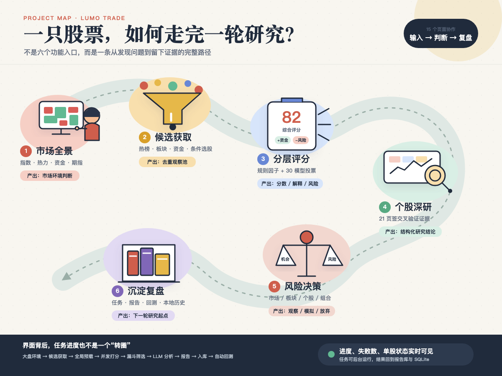
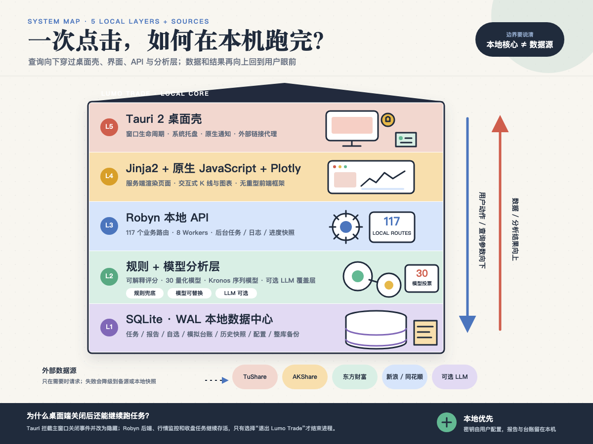

<div align="center">
  <h1><b>Lumo Trade</b></h1>
  <h3>本地智能投研控制台 · A 股研究桌面工作站</h3>
  <p>行情 · 资金 · 量化 · 风控 · 复盘，装进一台本地优先的桌面工作站</p>
</div>

<div align="center">


<a href="./LICENSE"></a>

</div>

<p align="center">
  
</p>

> Lumo Trade 是一套面向 A 股研究场景的**本地智能投研控制台**。它把"观察市场 → 发现机会 → 研究个股 →
> 识别风险 → 模拟执行 → 跟踪复盘"放在同一套桌面工作流里，让所有数据、任务和报告**尽量留在本机**。
>
> 底层以 **Kronos** 金融 K 线基础模型（AAAI 2026）作为序列预测能力，上层叠加 **30 个量化模型 + 可解释规则引擎**
> 完成机会挖掘与多因子评分。

---

## 📊 基础数字

| 指标 | 数量 |
|------|------|
| 桌面页面 | 15 个 |
| 个股分析页签 | 21 个 |
| 后端 API 路由 | 117 个 |
| 量化模型 | 30 个 |
| 自动化测试 | 109 个测试文件 |

---

## 🎯 核心价值：一条投研链路，而非一次预测

Lumo Trade 想解决的不是"预测一次"，而是串起一条完整的、本地优先的投研流水线：

```
市场全景  →  候选池  →  分层评分  →  个股深研  →  风控决策  →  沉淀复盘
  ①             ②           ③            ④            ⑤             ⑥
```

1. **建立市场全景** — 总览、大盘云图、资金榜单、量化雷达、股指期货、实时资讯
2. **形成候选池** — 多源机会挖掘、热门板块/热榜、主力资金 Top N、八维条件选股
3. **分层评分** — 机会挖掘引擎（30 模型 + 20+ 技术指标 + 三维情绪 + 规则评分），每一分都可追溯
4. **个股深研** — 21 个分析页签的股票工作台（行情/资金/筹码/基本面/概率/风控/AI 解读…）
5. **行动与风控** — 风险·机遇大屏（机会分 × 风险分同屏）、模拟盘低成本验证
6. **沉淀复盘** — 后台任务队列、报告库、机会历史、模拟台账、SQLite 数据仓库

### 本地优先的设计哲学

Lumo Trade 最核心的判断是：**AI 不该直接荐股**。LLM 只负责"把因子解释成人话"的深度分析，真正的决策逻辑
全部落在**可回测、可追溯、可审计**的规则与因子体系上。评分、回测、形态相似度和 AI 解读都不代表未来收益。

---

## 🖥️ 15 个桌面页面

| # | 页面 | 职责 |
|---|------|------|
| 1 | **总览** | 市场指标、个股快搜、实时异动、资讯入口、东方财富热榜、系统状态 |
| 2 | **大盘云图** | 全市场热力图（矩形面积=成交额，颜色=涨跌），多指数、四态过滤、历史回溯 |
| 3 | **风险·机遇** | 决策中枢：市场/板块/个股/持仓四层风险 + 机会×风险撮合矩阵 |
| 4 | **资金榜单** | 主力净流入榜 + 龙虎榜 + 量化交易分析（温度计/吸筹/收割预警） |
| 5 | **股指期货** | IF/IH/IC/IM 行情、基差、前 20 席位多空净持仓、近 10 日趋势 |
| 6 | **条件选股** | 八维 AND 组合：行情/主力资金/盘口/吸筹/龙虎榜/机会评分/技术形态/量化模型 |
| 7 | **分析工作台** | 机会挖掘与批量分析发起 + 投资机会画布（七种组织方式） |
| 8 | **挖掘引擎** | 把后台黑盒变成实时直播：阶段轨道、并发单元、实时日志、自动接管 |
| 9 | **形态搜股** | 手绘或载入个股形态 → 本地指纹库检索 → 相似股票 + 曲线对比 + 历史后验回测 |
| 10 | **自选与提醒** | 自选管理 + 周期扫描提醒 + 桌面底部实时热点条（六类信息流） |
| 11 | **模拟盘** | 本地账户台账，验证买入方式/持有周期/胜率，支持自动跟单（仅写模拟台账） |
| 12 | **星轨图谱** | 产业链同心轨道研究地图（轨道 × 概念板块 × 个股），可编辑、可下钻 |
| 13 | **报告与健康** | 报告库 + 评分算法健康度 + 回测状态 + 模块/数据源诊断 |
| 14 | **后台配置** | AI 模型/API Key、TuShare、Kronos 运行设备、模拟跟单、数据库备份迁移 |
| 15 | **关于与合规** | 免责声明、使用条款、数据来源（首次启动弹出风险提示） |

### 个股工作台：21 个分析页签

任何页面中的股票、榜单行、K 线、画布节点或自选项，一键打开统一的**股票工作台**（全局弹窗）：

快速信息 · 综合总览 · 市场周期 · 主力阶段 · 量价博弈 · 筹码结构 · 业绩预期 · 概率推演 · 操盘风控 ·
涨停筛选 · 主力深度 · 资金榜单 · 量化矩阵 · 筹码·控盘雷达 · 机构持仓 · 多空评审团 · AI 解读 ·
财务三大表 · 形态回测 · 关联热点 · 量化行为

其中**多空评审团**按价值/成长/宏观/技术/中国价投/游资/量化七流派、约 60 个规则化角色组织，规则基础不依赖大模型；
**AI 解读**使用用户自配置模型（OpenAI 兼容 / DashScope 兼容，支持通义千问/DeepSeek/MiniMax/Kimi/GLM 等）。

<p align="center">
  
  <br/>
  <em>投研六步链路：市场全景 → 候选池 → 分层评分 → 个股深研 → 风控决策 → 沉淀复盘</em>
</p>

---

## 🏗️ 技术架构

Lumo Trade 的技术栈让每一层承担适合自己的职责：

```
┌──────────────────────────────────────┐
│           Tauri 2 (Rust)             │  ← 桌面壳：窗口、托盘、通知、外部链接
├──────────────────────────────────────┤
│   Jinja2 模板 + 原生 JS + Plotly     │  ← 前端：服务端渲染，无重型框架
├──────────────────────────────────────┤
│       Robyn (Python, 8 Workers)      │  ← 本地 API：117 个路由，按业务域编排
├──────────────────────────────────────┤
│  规则引擎 + 30 量化模型 + Kronos AI  │  ← 分析层：规则、模型、LLM 三层并存
├──────────────────────────────────────┤
│          SQLite (WAL 模式)            │  ← 数据层：本地持久化中心，多域统一存储
├──────────────────────────────────────┤
│  TuShare / AKShare / 东财 / 新浪 …   │  ← 数据源：多源获取，明确降级路径
└──────────────────────────────────────┘
```

**分析层**三部分各司其职：可解释的规则与评分引擎、30 个量化模型、Kronos 金融基础模型（CPU/CUDA/Apple MPS）。
**数据源**预设主源 → 备源 → 本地缓存的回退路径，明确标注"数据不可用 / 已回退 / 仍使用历史数据"。

### 本地优先的数据策略

- **只在本地沉淀**：自选、模拟台账、任务状态、报告文件、数据库备份和大部分应用配置
- **外部数据请求**：行情、资金、新闻、财务和期货向相应数据源发送查询参数
- **可选云端大模型**：仅用户启用 Provider 后发起
- **密钥保护**：API Key 和 Token 由用户配置，不应出现在截图或发布内容中

<p align="center">
  
  <br/>
  <em>Lumo Trade 五层技术架构：Tauri（桌面壳）→ Robyn（本地 API）→ 分析层 → SQLite → 多源数据</em>
</p>

---

## 🚀 快速开始 (Quick Start)

### 系统要求

- Python 3.11+
- 可选：CUDA 或 Apple MPS（用于 Kronos 模型加速）

### 一键启动

```bash
# Linux / macOS
chmod +x quick_start.sh
./quick_start.sh

# Windows
quick_start.bat        # 或 .\quick_start.ps1（管理员 PowerShell）
```

### 环境配置

```bash
# 安装依赖
pip install -r requirements.txt

# 安装爬虫浏览器
pip install playwright && playwright install chromium

# 配置 Tushare Token（A 股数据源）
python scripts/setup_tushare.py

# 检查环境
python scripts/check_environment.py
```

### 启动桌面端 / Web UI

```bash
# Web UI（Flask / Robyn）
cd webui && python run.py    # 或 ./start.sh

# 桌面端 Lumo Trade 见 desktop/ + src-tauri/
```

---

## 🧠 底层模型：Kronos 预测

Lumo Trade 的 K 线序列预测能力由 **Kronos** 提供——第一个开源金融 K 线基础模型（AAAI 2026），基于全球 45+
交易所数据预训练。它采用两阶段框架：专用 **Tokenizer** 用 Binary Spherical Quantization (BSQuantizer) 把连续
OHLCV 数据量化为分层离散 token，再由自回归 **Transformer** 在 token 空间预测"下一根 K 线"。

| Model | Tokenizer | Context | Params |
|-------|-----------|---------|--------|
| Kronos-mini | Kronos-Tokenizer-2k | 2048 | 4.1M |
| Kronos-small | Kronos-Tokenizer-base | 512 | 24.7M |
| Kronos-base | Kronos-Tokenizer-base | 512 | 102.3M |

在 Lumo Trade 中，Kronos 只是分析层的一个组成（支持 CPU/CUDA/MPS），真正的投资判断由 30 个量化模型和可解释
规则引擎完成。Kronos 原始模型与微调、回测流程详见：
`[Kronos (shiyu-coder)](https://github.com/shiyu-coder/Kronos)`、[arXiv:2508.02739](https://arxiv.org/abs/2508.02739)。

---

## 🔎 核心能力详解

### 机会挖掘引擎

机会挖掘把运行过程拆成可见阶段：候选收集 → 数据准备 → 多智能体并行分析 → 评分排序 → 报告生成 → 结果入库。
从五路正交候选源（热榜 / 热门板块 / 超跌反弹 / 资金流向 / 低位放量）出发，经九维动态加权评分 + v25 共享规则
奖惩，生成综合评分、S/A+/A/B/C 评级与可追溯的加减分项，再经软筛漏斗与 LLM 深度分析，最终输出报告并自动回测。

### 条件选股：八维 AND 组合

留空条件不参与筛选，填写的条件间取 AND 交集：行情快照、主力资金、盘口异动、主力吸筹、龙虎榜、机会评分、
技术形态、量化模型。

### 风险·机遇：四层风险 + 机会×风险撮合

市场系统性风险 / 板块拥挤风险 / 个股自身风险 / 持仓组合风险，与机会分放到同一坐标系——避免"只看高分、
不看风险"的认知偏差。

---

## 📚 文档体系

| 文档 | 说明 |
|------|------|
| [docs/00_文档导航索引.md](docs/00_文档导航索引.md) | 全项目文档导航 |
| [docs/Lumo_Trade_桌面端完整指南.md](docs/Lumo_Trade_桌面端完整指南.md) | **Lumo Trade 桌面端完整指南** |
| [docs/01_投资机会挖掘系统完整文档.md](docs/01_投资机会挖掘系统完整文档.md) | 机会挖掘系统功能与架构 |
| [docs/03_系统架构技术文档.md](docs/03_系统架构技术文档.md) | 系统总体架构 |
| [docs/04_因子打分体系与回测优化完整技术文档.md](docs/04_因子打分体系与回测优化完整技术文档.md) | 打分系统技术细节 |
| [CLAUDE.md](CLAUDE.md) | AI 编程助手开发指南 |

---

## 💖 支持本项目 (Sponsor)

如果你觉得 Lumo Trade 对你有帮助，欢迎通过微信扫码赞助，支持项目的持续开发与维护。你的每一份支持都是项目前进的动力 🙏

<div align="center">
  
  <br/>
  <em>推荐使用微信支付扫码赞助</em>
</div>

---

## 📜 License

This project is licensed under the [MIT License](./LICENSE).

Copyright (c) 2025 Lumonote. See [LICENSE](LICENSE) for full text.

---

## 🤝 社区约定

- [贡献指南 (CONTRIBUTING.md)](CONTRIBUTING.md) — 如何提交代码、Commit 规范、Pull Request 流程
- [行为准则 (CODE_OF_CONDUCT.md)](CODE_OF_CONDUCT.md) — 社区成员行为规范
- [安全策略 (SECURITY.md)](SECURITY.md) — 漏洞报告渠道与响应流程

---

## 📖 Citing Kronos

If you use the underlying Kronos model in your research, please cite its [paper](https://arxiv.org/abs/2508.02739):

```
@misc{shi2025kronos,
      title={Kronos: A Foundation Model for the Language of Financial Markets},
      author={Yu Shi and Zongliang Fu and Shuo Chen and Bohan Zhao and Wei Xu and Changshui Zhang and Jian Li},
      year={2025},
      eprint={2508.02739},
      archivePrefix={arXiv},
      primaryClass={q-fin.ST},
      url={https://arxiv.org/abs/2508.02739},
}
```

---

## ⚠️ 免责声明

Lumo Trade 是数据和**研究工具**，不是持牌证券投资咨询服务。评分、回测、形态相似度和 AI 解读不代表未来收益；
吸筹、主力、控盘、情绪和风险等指标来自公开数据和算法代理，不是对真实交易主体意图的确定识别；模拟盘使用日 K
近似撮合，不能复现真实分时流动性、滑点和冲击成本。所有分析仅供研究与学习参考，**不构成投资建议**，股市有风险，
投资需谨慎。