# Lumo Trade

<div align="center">
  <p><strong>本地优先的 A 股智能投研工作站</strong></p>
  <p>行情 · 资金 · 量化 · 风控 · 模拟盘 · 复盘</p>

  <p>
    <a href="https://github.com/Lumonote/lumo_trade/actions/workflows/build.yml"></a>
    <a href="./LICENSE"></a>
    <a href="https://www.python.org/downloads/"></a>
    <a href="https://v2.tauri.app/"></a>
    <a href="https://www.sqlite.org/"></a>
  </p>
</div>

<p align="center">
  
</p>

> **落子无悔。** Lumo Trade 把“观察市场 → 发现机会 → 研究个股 → 识别风险 → 模拟执行 → 跟踪复盘”串成一条可追溯的本地投研链路。

Lumo Trade 面向 A 股研究、量化实验和投资复盘场景。它不是自动荐股工具：评分、规则、回测和 AI 解读都保留数据依据与风险提示，最终判断由使用者完成。

## 为什么使用 Lumo Trade

- **研究链路完整**：从市场全景、候选池、分层评分到个股深研、风险决策和复盘沉淀，减少在多个工具之间切换。
- **本地优先**：自选、任务、报告、模拟台账和 SQLite 数据仓库默认留在本机；外部数据源按配置调用。
- **解释优先**：30 个量化模型、技术指标、资金与情绪因子，以及可解释规则引擎共同构成评分依据。
- **风险同屏**：机会分与市场、板块、个股、持仓四层风险一起查看，避免只看信号不看风险。
- **可选 Kronos 预测**：集成 Kronos 金融 K 线基础模型，支持 CPU、CUDA 和 Apple MPS；预测结果用于研究，不替代规则与风控。

## 核心能力

| 模块 | 能力 |
| --- | --- |
| 市场全景 | 指数行情、全市场热力图、板块动量、实时资讯与系统健康度 |
| 机会挖掘 | 热榜、热门板块、资金流向、超跌反弹、低位放量等候选源；多因子评分与报告生成 |
| 个股工作台 | 行情、资金、筹码、基本面、概率推演、操盘风控、量化矩阵、AI 解读等分析页签 |
| 条件选股 | 行情、主力资金、盘口、吸筹、龙虎榜、机会评分、技术形态、量化模型八维组合筛选 |
| 风险与机遇 | 机会 × 风险矩阵、市场/板块/个股/持仓风险分层和组合观察 |
| 资金与期指 | 主力净流入、龙虎榜、量化行为、IF/IH/IC/IM 行情、基差和席位趋势 |
| 形态搜股 | 手绘或载入形态，检索相似股票并查看曲线对比与历史后验表现 |
| 模拟盘与复盘 | 本地账户、模拟成交、持仓跟踪、报告库、机会历史和自动复盘 |

## 界面截图与功能说明

以下截图来自本地 Web UI / Tauri 桌面端，用于展示信息组织方式和典型研究流程。截图中的行情、日期、股票和新闻均为采集时的示例数据，实际内容取决于数据源、交易日和本地配置。

### 市场总览与实时信息

| 界面 | 说明 |
| --- | --- |
| 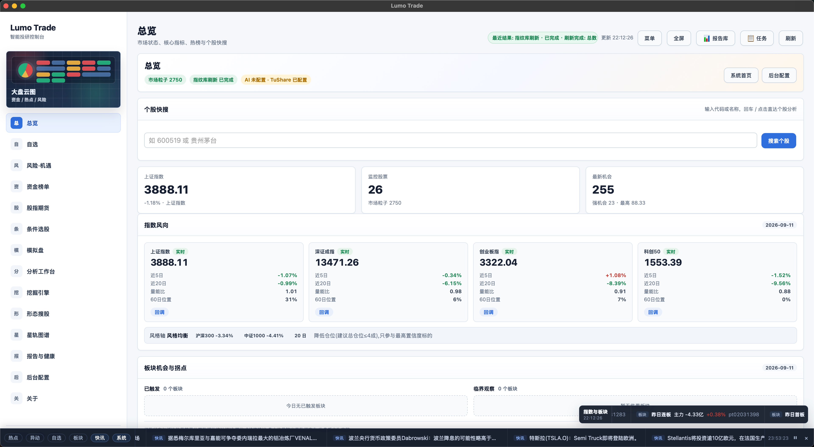 | **总览**：集中查看指数方向、监控股票、最新机会、板块热点和系统状态；顶部搜索可直接进入个股工作台。 |
| 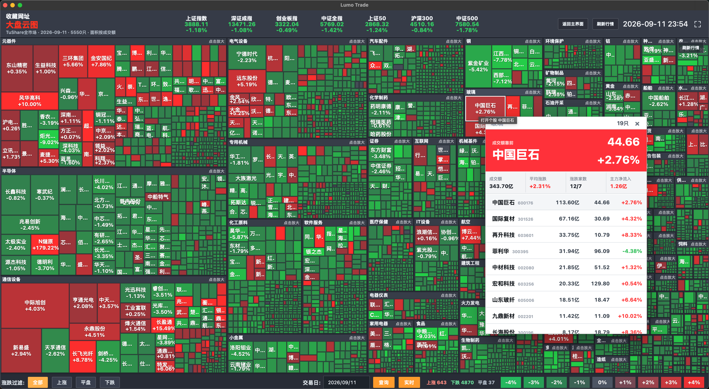 | **大盘云图**：用矩形面积表示成交额、颜色表示涨跌，支持按行业下钻到板块和个股，并查看指定交易日。 |
| 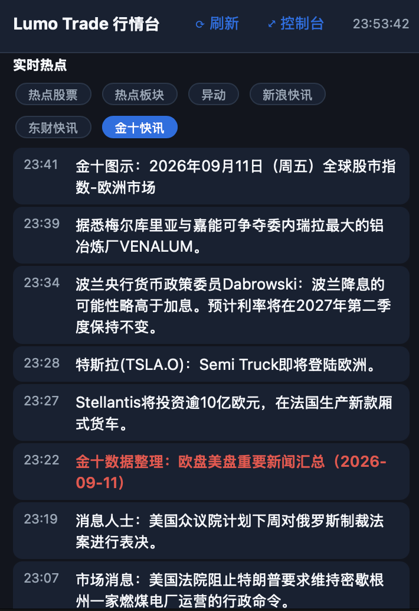 | **实时热点**：按热点股票、热点板块、异动和新闻源筛选信息流；不同来源用标签区分，便于快速定位事件线索。 |

### 机会发现与研究

| 界面 | 说明 |
| --- | --- |
| 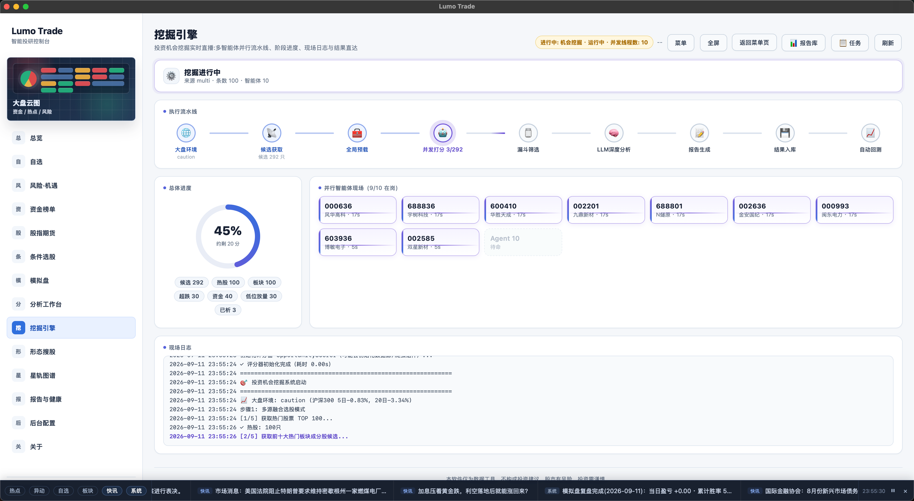 | **挖掘引擎**：把候选获取、全局预载、并发评分、漏斗筛选、LLM 深度分析、报告生成和结果入库拆成可观察阶段，并显示并行任务进度。 |
| 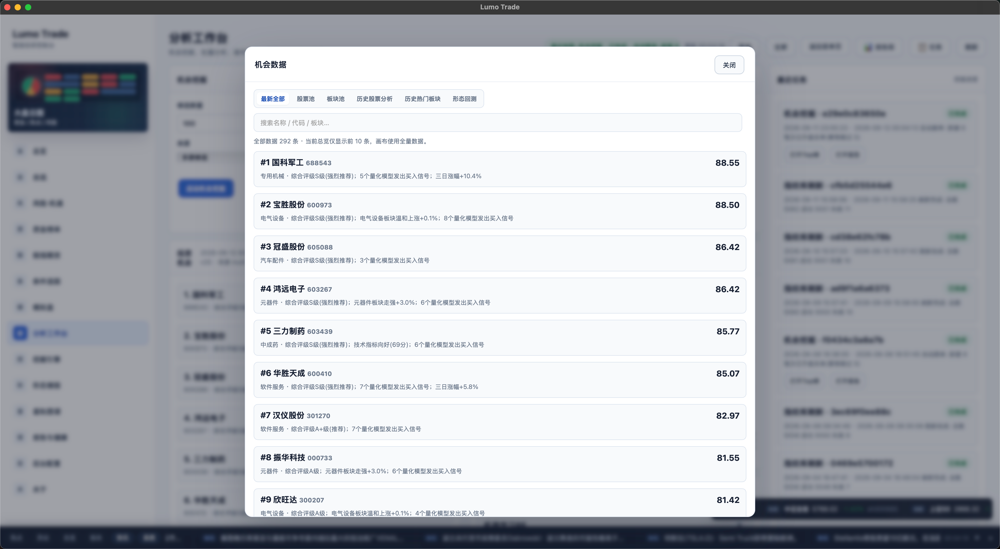 | **机会数据**：按最新结果、股票池、板块池、历史分析和形态回测浏览机会；支持搜索、查看评分依据和打开个股分析。 |
| 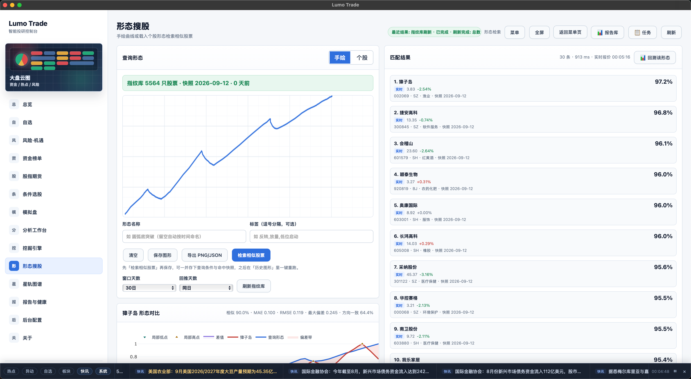 | **形态搜股**：手绘或载入一段形态，在本地指纹库中检索相似股票，并查看相似度、误差和后续表现。 |
| 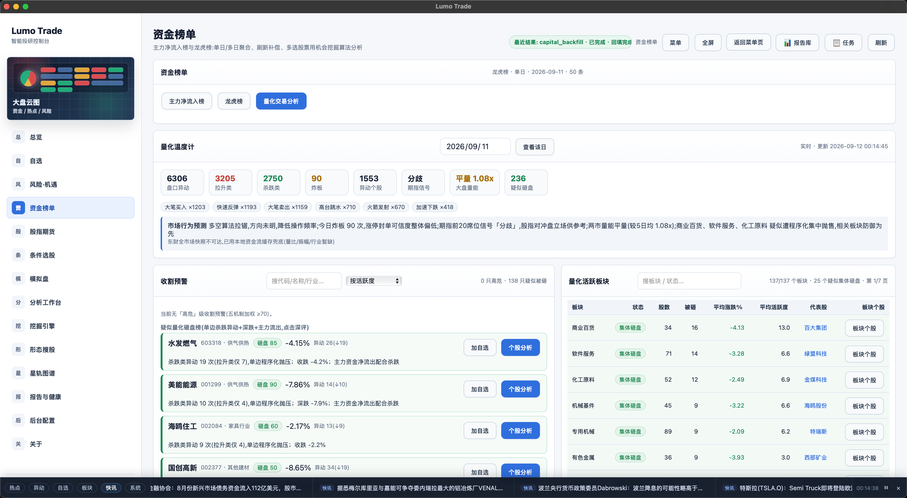 | **个股工作台**：汇总资金面、技术面、筹码机构、模型预测和回测等信号；各指标保留来源和状态，便于复核。 |
| 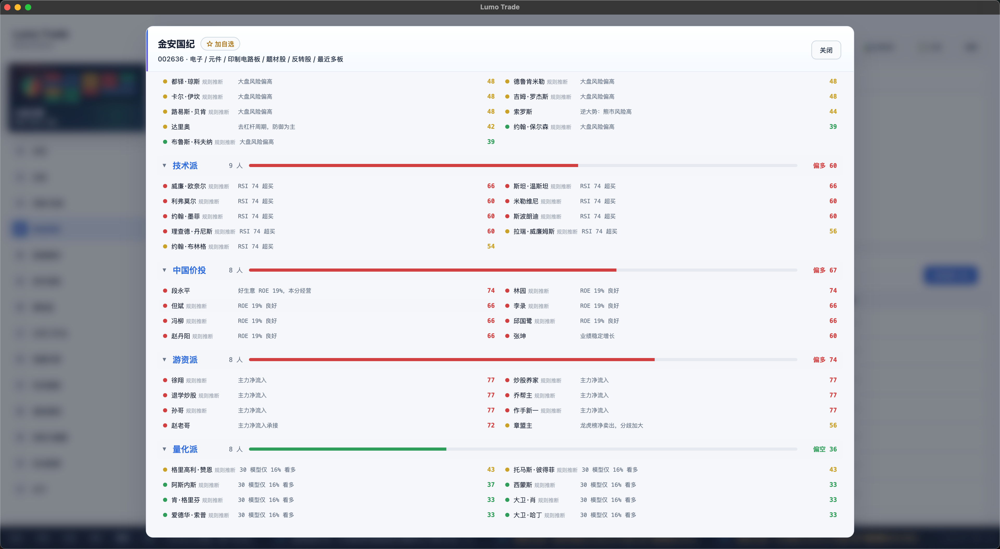 | **多空评审团**：按宏观、价值、成长、技术、中国价投、游资和量化等流派分组展示规则化观点，分别给出评分、依据和多空倾向，用于交叉验证而非生成单一结论。 |

### 资金、期指与量化行为

| 界面 | 说明 |
| --- | --- |
| 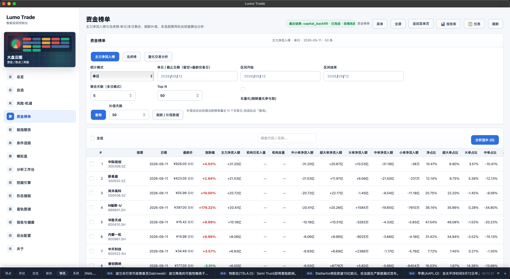 | **主力资金榜**：按单日或区间查看主力净流入、机构和大单拆分，支持勾选多只股票后批量发起分析。 |
| 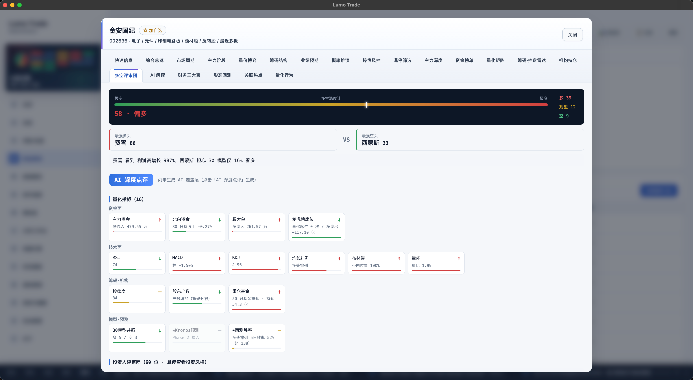 | **龙虎榜**：查看上榜原因、机构买卖、龙虎榜净买入和成交占比，并展开股票详情。 |
| 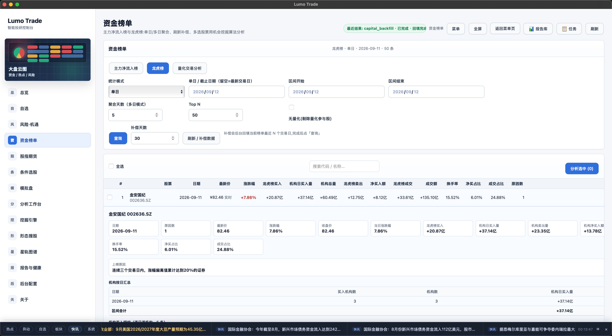 | **量化交易分析**：展示拉升、杀跌、炸板、疑似砸盘等行为统计，以及量化活跃板块和收割预警，作为风险线索使用。 |
| 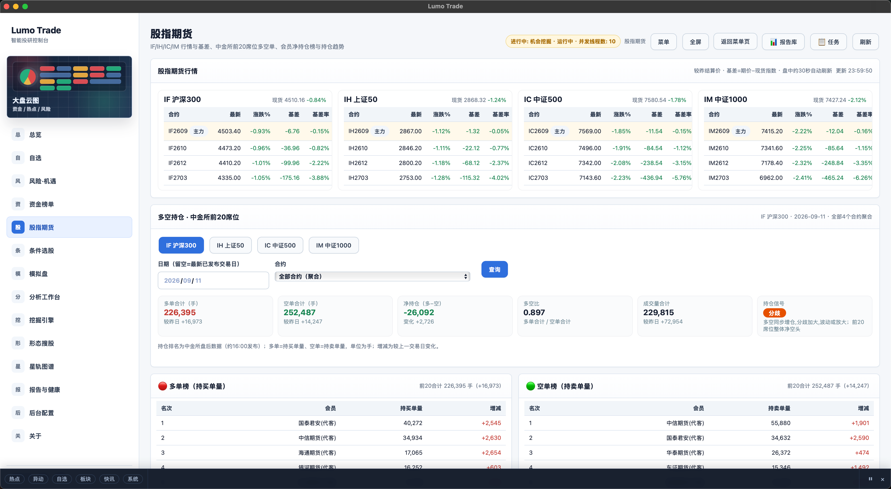 | **股指期货**：覆盖 IF、IH、IC、IM 的合约行情、现货、基差和中金所前 20 席位多空持仓，支持按交易日查询。 |

### 产业图谱、模拟盘与配置

| 界面 | 说明 |
| --- | --- |
| 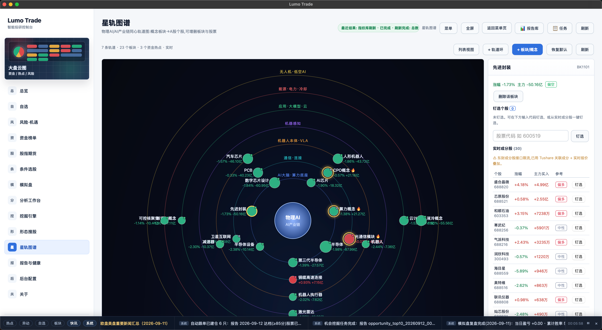 | **星轨图谱**：以产业链为中心组织概念板块和个股，支持轨道、板块和概念视图切换，以及钉选股票继续深研。 |
| 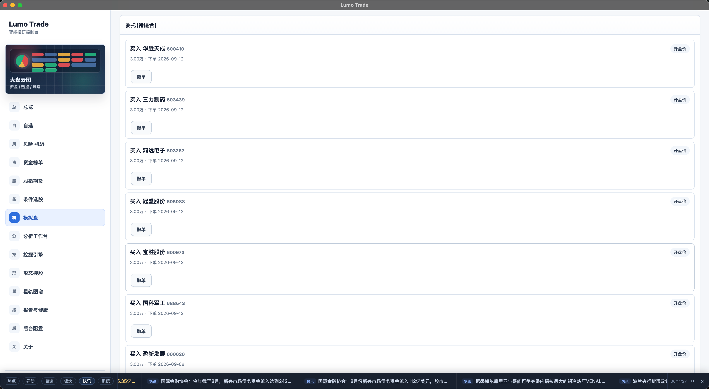 | **模拟盘**：记录模拟委托、成交和撤单状态，验证仓位、持有周期和策略执行；不会触发真实交易。 |
| 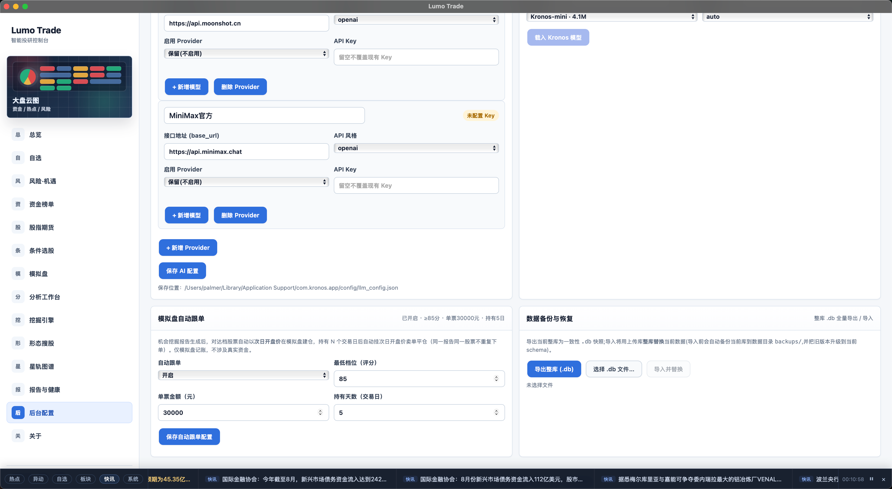 | **后台配置**：管理 LLM Provider、接口地址、模型、数据源、模拟盘参数和 SQLite 备份恢复；密钥只保存在本地配置目录。 |

### 使用建议

建议先从“总览”确认市场与数据源状态，再进入“机会挖掘”或“资金榜单”形成候选池，随后在“个股工作台”复核因子和风险，最后用“模拟盘”和“报告库”沉淀结果。截图中的信号是研究线索，不代表买卖指令。

## 架构

```text
Tauri 2 桌面壳
    │
    ├── 原生 JavaScript + Jinja2 + Plotly 前端
    ├── Robyn 本地 API（webui/）
    ├── 规则引擎 + 量化模型 + 可选 Kronos 推理
    └── SQLite 本地数据层（data_store/）
             │
             └── TuShare / AKShare / 东方财富 / 新浪等数据源
```

桌面端通过 `src-tauri/` 启动本地 Robyn 服务；源码运行与 CI 打包均使用 `webui/run_robyn.py`。打包工作流默认使用 `lite` 后端，以缩短构建时间；需要模型推理时请按源码方式安装完整依赖。

## 快速开始

### 1. 下载安装包（推荐）

前往 [GitHub Releases](https://github.com/Lumonote/lumo_trade/releases) 下载对应平台的安装包：

| 平台 | 安装包 | 说明 |
| --- | --- | --- |
| macOS · Apple Silicon | `*.dmg`（arm64） | M 系列芯片 |
| macOS · Intel | `*.dmg`（x64） | Intel 芯片；Apple Silicon 也可经 Rosetta 运行 |
| Windows | `*.msi` / `*.exe` | x64 |

安装包已内置本地后端，**不需要**单独安装 Python、Node.js 或 Rust，装完双击即用。

> 只有推送 `v*` 标签（如 `v1.1.6`）才会生成 GitHub Release；平时推送到 `main` / 其他分支的产物只留在
> Actions 的 Artifacts 中，保留期分别为 14 天 / 7 天。

#### macOS：安装后第一次打不开怎么办

社区构建没有购买 Apple 开发者证书，安装包使用 **ad-hoc 签名**（等同于未签名），也没有送给 Apple 做
公证（notarization）。所以 macOS 的 Gatekeeper **必然会拦一次**，你看到的多半是下面几种提示之一：

- 「"Lumo Trade" 无法打开，因为 Apple 无法检查其是否包含恶意软件。」
- 「"Lumo Trade" 无法打开，因为无法验证开发者。」
- 「"Lumo Trade" 已损坏，无法打开。你应该将它移到废纸篓。」

这三种提示说的是同一件事：**系统无法验证开发者身份**，而不是安装包真的损坏或下载失败。按下面的顺序
处理，第 1 步不行再往下走：

1. **拖入「应用程序」**：打开 dmg，把 `Lumo Trade.app` 拖进「应用程序」。
2. **右键打开**：在「应用程序」里 **按住 Control 点击（或右键）** App → 选「打开」→ 在弹窗里再点一次
   「打开」。注意：直接双击只会出现「移到废纸篓 / 完成」，不会给你「打开」按钮。
3. **在系统设置里放行**：「系统设置 → 隐私与安全性」，滚到底部「安全性」区域，会看到被拦截的提示，
   点「仍要打开」并输入登录密码确认。（macOS 15 起弹窗不再提供「打开」，只能走这里。）
4. **移除隔离属性**（提示「已损坏」或前几步都无效时最有效）：

   ```bash
   xattr -dr com.apple.quarantine "/Applications/Lumo Trade.app"
   open "/Applications/Lumo Trade.app"
   ```

   若直接从 dmg 挂载卷里运行，把路径换成挂载卷下的 App，例如
   `xattr -dr com.apple.quarantine "/Volumes/Lumo Trade/Lumo Trade.app"`。
5. **仍然打不开**：先确认安装包与芯片架构匹配（Apple Silicon 用 arm64 包，Intel 用 x64 包），或改用
   下面的「从源码运行」。

几点补充说明：

- **只从本仓库 Releases 下载。** 第三方转发的包无法核对来源，也不要为了省掉一次弹窗就全局关闭 Gatekeeper。
- 放行只需要做一次，之后系统会记住这个选择。
- 想彻底消除弹窗，需要 Apple Developer Program 会员（99 美元/年）做 Developer ID 签名 + 公证；社区构建
  不做这件事，属于预期行为，不是本项目可以「修好」的缺陷。

#### Windows：SmartScreen 提示

Windows 安装包同样未做代码签名，SmartScreen 会提示「Windows 已保护你的电脑」。点「更多信息」→「仍要运行」
即可继续安装。

#### 卸载与本地数据

应用数据（SQLite 数据库、报告、日志、配置）不在 `.app` 内部，卸载应用后仍然保留：

| 平台 | 数据目录 |
| --- | --- |
| macOS | `~/Library/Application Support/com.lumo.trade/` |
| Windows | `%APPDATA%\com.lumo.trade\` |

需要彻底清理时，先把应用拖入废纸篓，再删除上面的目录（**删除前请先备份**，整库快照可在「后台配置 → 数据与模拟盘」里导出）。

### 2. 从源码运行

#### 环境要求

- Python 3.11 或更高版本（CI 与打包均使用 3.11）
- Node.js 22（仅开发或构建桌面端需要）
- Rust stable 与 Tauri 系统依赖（仅开发或构建桌面端需要）
- 可选：CUDA 或 Apple MPS；可选：Playwright Chromium（爬虫与浏览器采集）

> **Intel macOS / Python 3.13 的 torch 说明**：torch 自 2.3 起不再发布 Intel macOS wheel。`requirements.txt`
> 已按平台分流，Intel Mac 会退回可用的 2.2.x，Intel Mac + Python 3.13 则自动跳过 torch。打包默认的 `lite`
> 模式本就不含 torch / modelscope —— 数据、机会挖掘和 Web 界面照常可用，只有 Kronos 模型推理类功能不可用。

#### 安装依赖

建议使用虚拟环境：

```bash
python3.11 -m venv .venv
source .venv/bin/activate                 # Windows: .venv\Scripts\activate
python -m pip install --upgrade pip
pip install -r requirements.txt
```

如需浏览器采集：

```bash
pip install playwright
playwright install chromium
```

### 3. 配置数据源（TuShare 需要一定积分）

```bash
python scripts/setup_tushare.py
python scripts/check_environment.py
```

**关于 TuShare 积分**：TuShare Pro 的接口按「积分」分级开放，一个 Token 并不等于所有数据都能取。本项目
用到的数据里，**有一部分需要 5000 积分**才能调用（例如筹码/成本分布、机构调研等），资金流向、龙虎榜、
股东户数、财务三大表等多为 2000 积分档，基础日线行情门槛最低。积分不够时程序不会崩，对应页面会明确显示
「数据不可用 / 已降级 / 仍使用历史数据」。

还没有账号的话，可以通过邀请链接注册（通过邀请注册可累积积分，更快到达 5000 积分门槛）：

> **TuShare 邀请注册**：<https://tushare.pro/weborder/#/login?reg=711997>

注册后在用户中心复制 Token，填入「后台配置 → TuShare 数据源」，或直接运行 `python scripts/setup_tushare.py`
按提示交互写入。Token 与 LLM API Key 只写本地配置目录，**不要提交到 Git**：

| 运行方式 | Token 落盘位置 |
| --- | --- |
| 源码运行 | `config/tushare_config.json` |
| macOS 安装包 | `~/Library/Application Support/com.lumo.trade/config/tushare_config.json` |
| Windows 安装包 | `%APPDATA%\com.lumo.trade\config\tushare_config.json` |

不配置 Token 也能跑：AKShare / 东方财富 / 新浪等公开数据源配合本地缓存兜底，但覆盖面和稳定性会下降，
报告里会标注实际使用的来源。具体数据源与模型配置见 [桌面端完整指南](docs/Lumo_Trade_桌面端完整指南.md)。

### 4. 启动 Web UI

```bash
cd webui
python run_robyn.py
```

打开 <http://localhost:7070>。也可以使用兼容入口 `python run.py`；两者都会启动 Robyn 服务。

### 5. 开发与打包桌面端（可选）

```bash
npm ci
npm run desktop:dev      # 开发模式（tauri dev）
npm run desktop:build    # 本机构建安装包（tauri build）
```

本地要打出可用的安装包，需要**先构建内置后端**，Tauri 再把它作为 resource 打进包里（顺序不能反）：

```bash
python packaging/scripts/build_backend.py --clean --mode lite
npm run desktop:build
```

跨平台构建由 [.github/workflows/build.yml](.github/workflows/build.yml) 负责：推送到任意分支产出测试包，
推送到 `main` 产出正式包，只有推送 `v*` / `V*` 标签才会把安装包附到 GitHub Release。构建矩阵为
macOS（arm64 + x64，`macos-latest` / `macos-15-intel`）与 Windows；Linux 因构建失败已临时下线。

## 常用目录

```text
analysis/       评分规则、量化分析与评审团
data_store/     SQLite 仓储与多源数据适配
docs/           功能、架构、部署和回测文档
model/          Kronos 模型与预测接口
scripts/        数据采集、配置、检查和研究脚本
webui/          Robyn API、模板、静态资源与服务
src-tauri/      Tauri 2 桌面壳
tests/          Python 测试
```

## 测试与质量检查

运行完整 Python 测试：

```bash
python -m pytest tests/ -q
```

涉及评分规则、数据源或模拟盘的改动，请同时补充对应测试，并在 Pull Request 中说明数据假设、回测区间和验证结果。

## 文档

- [文档导航索引](docs/00_文档导航索引.md)
- [Lumo Trade 桌面端完整指南](docs/Lumo_Trade_桌面端完整指南.md)
- [系统架构技术文档](docs/03_系统架构技术文档.md)
- [投资机会挖掘系统文档](docs/01_投资机会挖掘系统完整文档.md)
- [因子打分体系与回测优化](docs/04_因子打分体系与回测优化完整技术文档.md)
- [Web UI 使用说明](webui/README.md)
- [更新日志](CHANGELOG.md) — 版本历史与变更记录
- [贡献指南](CONTRIBUTING.md) · [行为准则](CODE_OF_CONDUCT.md) · [安全策略](SECURITY.md)

## 贡献

欢迎提交 Issue、改进文档和 Pull Request。提交前请阅读 [CONTRIBUTING.md](CONTRIBUTING.md)，保持改动聚焦，并在 PR 中提供复现步骤和验证结果。

## 捐赠一点 token

Lumo Trade 是靠 token 喂大的——每一次个股深研、每一轮多空辩论，背后都是实打实的模型推理开销。

如果它帮到了你，欢迎**捐赠一点 token**：所有打赏都会用来补贴模型推理与数据源的调用成本，让它能继续跑下去。

完全自愿，不构成任何服务对价，不影响功能与授权，也不构成任何投资建议。

<p align="center">
  
</p>

## 许可

本项目以 [MIT License](LICENSE) 发布。底层 Kronos 模型与论文信息请参阅 [Kronos](https://github.com/shiyu-coder/Kronos) 和 [arXiv:2508.02739](https://arxiv.org/abs/2508.02739)。

## 免责声明

Lumo Trade 是用于数据分析、策略研究和模拟复盘的开源软件，不是持牌证券投资咨询服务。行情、资金、评分、回测、形态相似度、主力/控盘代理指标和 AI 解读不代表未来收益，也不构成投资建议。真实交易前请独立核验数据、流动性、滑点、交易成本和适当性风险。
