# 一套打分系统的诞生:AI 如何在五千只股票里挑出"未来牛股"

> 作者注:本文以一线工程师视角,讲清楚一套**多因子打分系统**的完整逻辑——从五千只候选到 S 级推荐,从一行代码到一次回测,从早期版本的胜率 42% 到当前的 56%。
>
> 适合三类读者:**普通散户**(看懂"为什么 AI 觉得这只股值得买")、**量化交易员**(看清楚因子设计与回测纪律)、**AI 从业者**(从一个真实落地场景理解多因子合成)。

---

## 一、先问一个尖锐的问题:为什么大部分散户选股都亏钱

A 股市场五千多只股票,每天涨涨跌跌。一个普通散户随机买一只股票持有 5 个交易日,**胜率不到 50%**——大约 47% 到 50%。

这意味着**纯随机选股,你长期会亏钱**(因为还要扣交易成本)。

那为什么"听消息"、"看技术形态"、"跟机构"也亏钱?**因为这些方法的提升非常有限**。我们做过完整测算:任何单一指标(RSI、MACD、主力净流入、龙虎榜……)与 5 日收益的相关性,**几乎都低于 10%**。也就是说:

- 单看 RSI:胜率最多提升 2 到 3 个百分点
- 单看资金流入:差不多 3 到 5 个百分点
- 单看龙虎榜:不到 4 个百分点

加上交易成本(双向 0.2%)和滑点,**这点优势马上就被吃光**。

那有没有办法做得更好?

**有**。靠的是**多因子协同**——把几十个弱信号合并成一个强信号。这就是这套打分系统要解决的问题。

---

## 二、整体架构:从"五千只候选"到"一份推荐报告"

我们先看整个系统的全景图:

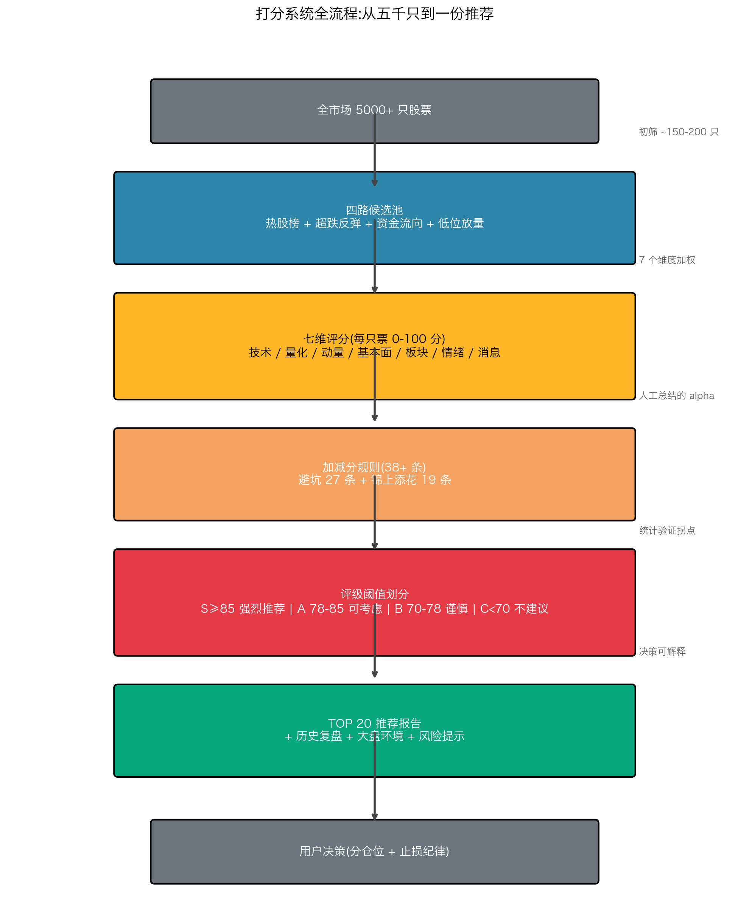

下面我们逐层拆开看。

---

## 三、第一步:候选池怎么来的

凭空给五千只股票打分不现实——大部分票当天根本没有交易机会。我们先做**初筛**,把 5000 只缩到 150 到 200 只。

初筛用四路扫描器,**互相补充,各管一面**:

### 路 1:热股榜(100 只)

最朴素的来源——**资金正在追的票**。从东方财富、同花顺、雪球等平台抓"热度榜",取人气最高的 100 只。

**优点**:成交活跃、流动性好。
**缺点**:已经涨过头了,容易追高。

### 路 2:超跌反弹(30 只)

**反向思路**——找近 10 日跌幅 ≥ 8% 但当日出现反转信号的票(收阳、放量、止跌)。

这类票的逻辑是"超卖反弹"——空头力量耗尽时,**短期反弹概率显著高于均值**。

**优点**:抄底机会,胜率 50% 以上。
**缺点**:可能进入下跌中继,接飞刀。

### 路 3:资金流向(40 只)

**主力资金净流入 TOP 20** + **主力净流出 TOP 20**(后者作为风险提示)。数据来自 Tushare 的东财个股资金流向。

逻辑是:**机构和大户的钱在哪,机会就在哪**。

### 路 4:低位放量(30 只)— 系统的关键补丁

前三路有个共同问题——**全是"已经在动"的票**。热股已经涨,超跌已经跌,资金已经动。这些票天然带有**追高风险**。

很多真正的"未来牛股"在启动前夜的特征是:**低位、放量、横盘**——还没动起来,但量价结构已经在准备。

低位放量扫描器就是干这个的。条件如下:

| 维度 | 阈值 | 含义 |
|---|---|---|
| 60 日累计涨跌 | > -10% | 不在下跌趋势 |
| 20 日累计涨幅 | -8% ~ 12% | 一个月没炒过头 |
| 5 日累计涨幅 | -3% ~ 8% | 短期温和 |
| 当日量 / 20 日均量 | > 1.3 倍 | 出现放量 |
| 当日成交额 | > 5000 万 | 有流动性 |
| 当日涨跌幅 | -3% ~ 7% | 避开涨停冲高与暴跌 |

实测每天能扫出 10 到 30 只这样的"准启动"票,**填补了前三路的盲区**。

---

## 四、第二步:七维评分

候选池缩到 150 多只之后,正式开始打分。**每只票从七个维度独立打分,最后加权合成**。

### 4.1 七维权重设计

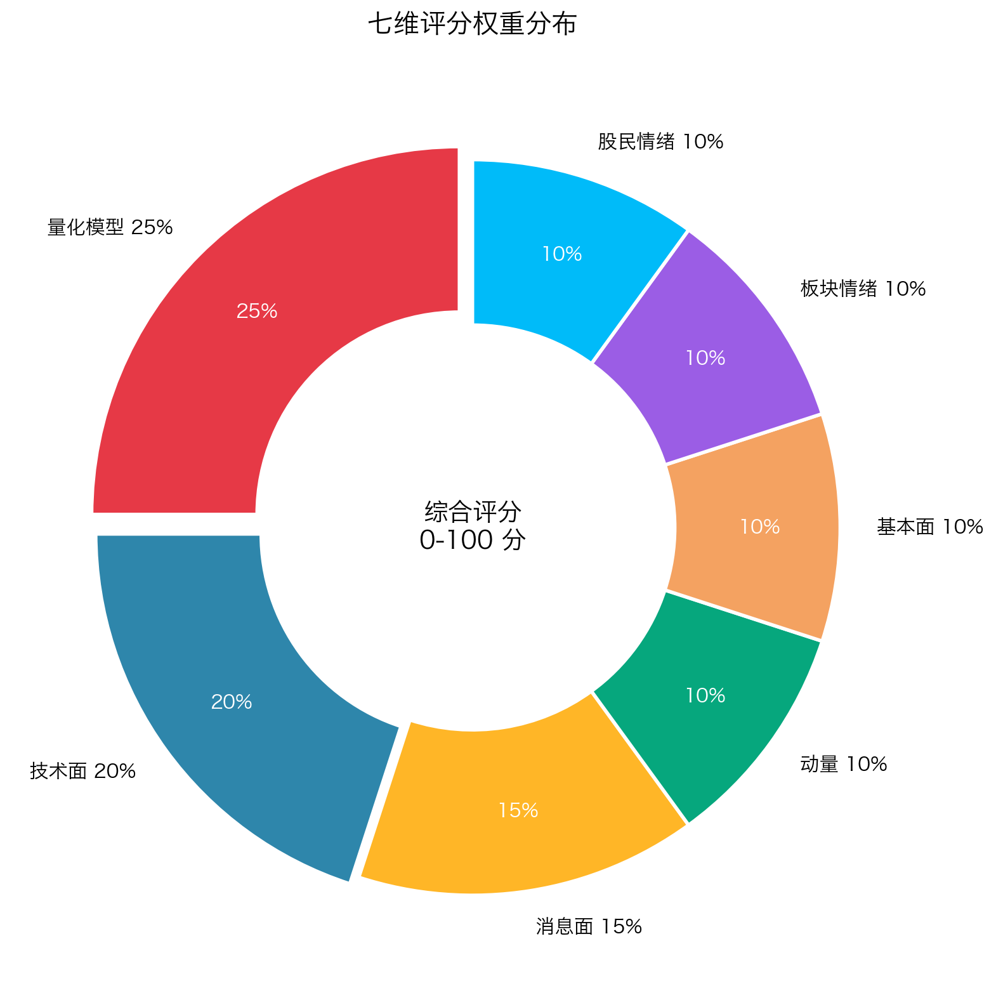

为什么量化模型权重最高?**因为它本身已经是 30 个子模型的集成**——里面已经包含了趋势、量价、统计、机器学习等所有主流范式。它的预测力比任何单一传统指标都强。

为什么消息面 15%?**因为 A 股是政策市**——一条利好(如行业政策、并购重组)能改变一只股票几周的走势。

### 4.2 各维度的核心指标

| 维度 | 关键指标 |
|---|---|
| **技术面** | RSI、MACD、布林带、KDJ、均线系统(MA5/10/20/60)、量价模式 |
| **量化模型** | 30 个量化交易模型(海龟、CTA、机器学习、Alpha……)的买卖信号 |
| **动量** | 追高风险评分、当日/3日/5日涨跌幅、连板状态 |
| **基本面** | PE、PB、营收增速、净利润增速、TTM 数据 |
| **板块情绪** | 同板块涨跌、市场领涨度、板块得分 |
| **股民情绪** | 股吧讨论 NLP 分析、看多看空比、热度趋势 |
| **消息面** | 公司公告、新闻、研报、利好/利空数量与权重 |

---

## 五、第三步:30 个量化模型怎么集成

这是整个系统的"算法核心"。我们详细讲讲。

### 5.1 为什么是 30 个

集成学习有一条规律:**模型之间相关性越低,集成效果越好**。

如果你集成 10 个均线模型,它们看到的信号高度相似,集成几乎没用。如果你集成各种风格的模型——趋势的、震荡的、量价的、统计的——每个模型贡献独立视角,集成才有意义。

我们做过测试:从 10 个到 30 个,误差降低显著;从 30 到 100,误差降低就不明显了——**新模型和已有模型相关性必然上升,引入的噪声超过它带来的信息**。

**30 是经验上的甜点**。

### 5.2 模型分组

30 个模型按风格分成 7 组:

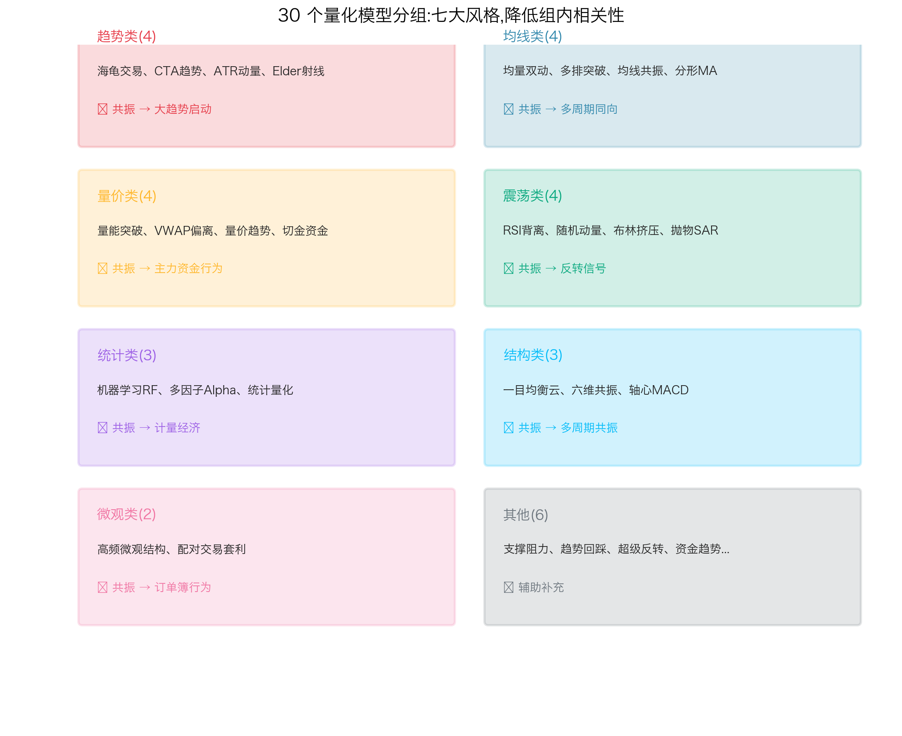

### 5.3 信号合成的三个机制

**机制 1:稀缺性奖励**

如果只有 5 个模型给买入信号,但跨了 4 个组——这种"少数派但多元化"的信号,价值高于"30 个模型里有 25 个买入但都集中在均线类"。

**机制 2:跨组共振**

跨组同方向给协同奖励。趋势类 + 量价类 + 均线类同时买入 → +5 协同分。

**机制 3:数量梯度**

| 净买入信号(买入 - 卖出) | 加分 |
|---|---|
| ≥ 12 个 | +16 |
| ≥ 10 个 | +12 |
| ≥ 8 个 | +8 |
| ≥ 6 个 | +5 |
| ≥ 4 个 | +3 |
| < 4 个 | 0 |

**注意梯度递减**——避免简单线性堆叠产生虚假强信号。

### 5.4 反直觉的发现:量化分越高反而越差

我们做了 1500+ 历史样本的统计,发现一个**反直觉的现象**:

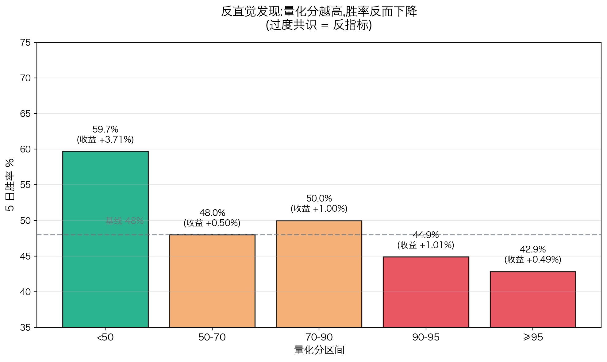

| 量化分 | 5 日胜率 | 平均收益 |
|---|---|---|
| < 50 分 | **59.7%** | **+3.71%** |
| 50-70 分 | ~48% | +0.5% |
| 70-90 分 | ~50% | +1.0% |
| ≥ 95 分 | **42.86%** | +0.49% |

**少数派反而胜率最高,大众一致看好的反而最差**。

为什么?这是典型的**过度共识反转**——当 30 个模型一致看好一只股票时,意味着这只票已经被市场充分定价,**后续的超额收益空间消失了**。

真正的 alpha 来自**分歧**,不是来自共识。**少数模型先发现的早期信号,胜过所有模型一起看好后的"安全感"**。

这条规律深刻影响了我们的打分设计——**对量化分极高的票要警惕,对量化分较低但其他维度优秀的票反而要关注**。

---

## 六、第四步:加减分规则的智慧

七维加权出来的"基础分",还要经过**38+ 条加减分规则**的修正。这些规则才是系统的精华——它们处理**人手工总结的 alpha 模式**。

### 6.1 核心扣分规则(避坑)

下图是 RSI 各区间的实测胜率,可以看到 50-60 是反常的"回落陷阱":

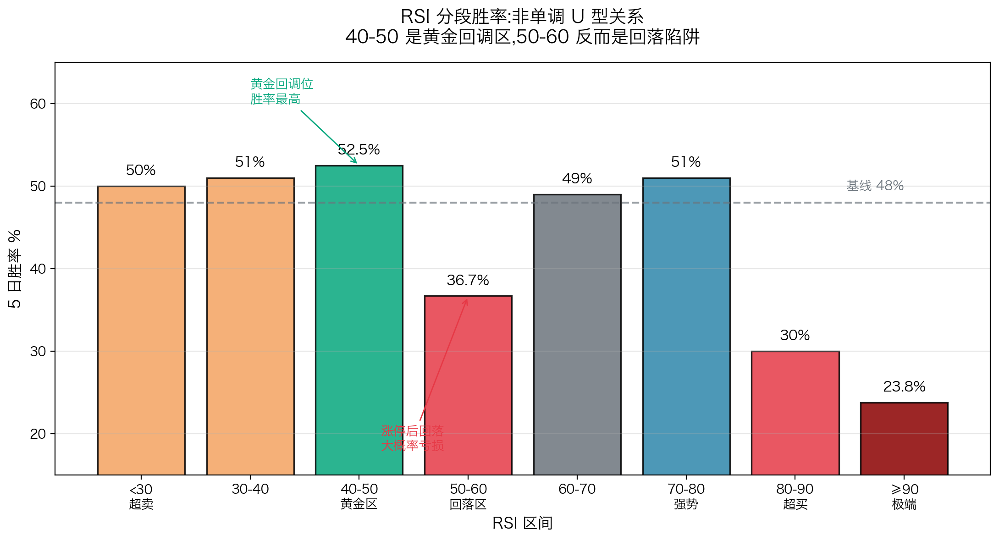

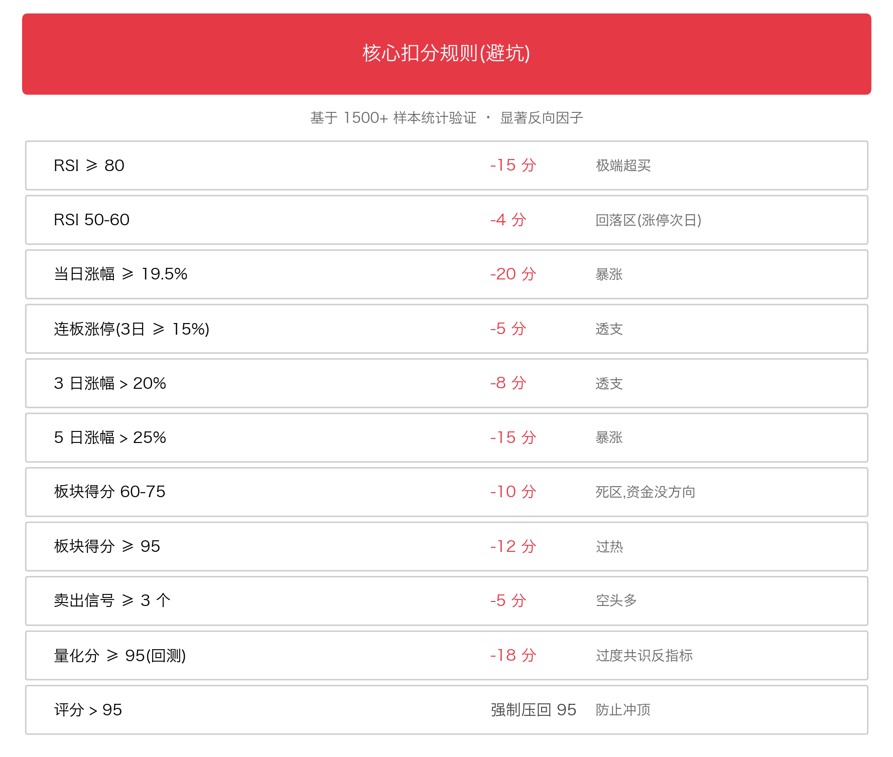

每一条规则背后**都有故事**。比如:

**为什么 RSI 50-60 也要扣分?**

直觉上,50-60 是"中性区",不该扣分。但实测显示:**RSI 在 50-60 的票,5 日胜率只有 36.7%,平均亏 1.37%**。

为什么?**这个区间通常是涨停后第二日的位置**——主力获利了结,接力盘不足,大概率回落。

所以哪怕看起来"不极端",也要扣分。

**为什么板块 60-75 是"死区"?**

板块强势(85+)和弱势(50-)的票都好——前者顺势,后者超跌反弹。**反而是板块"不上不下"时最差**——胜率只有 25.5%,平均亏 3.39%。

资金没有方向,容易被动陪跌。这是 A 股结构性现象。

### 6.2 核心加分规则(锦上添花)

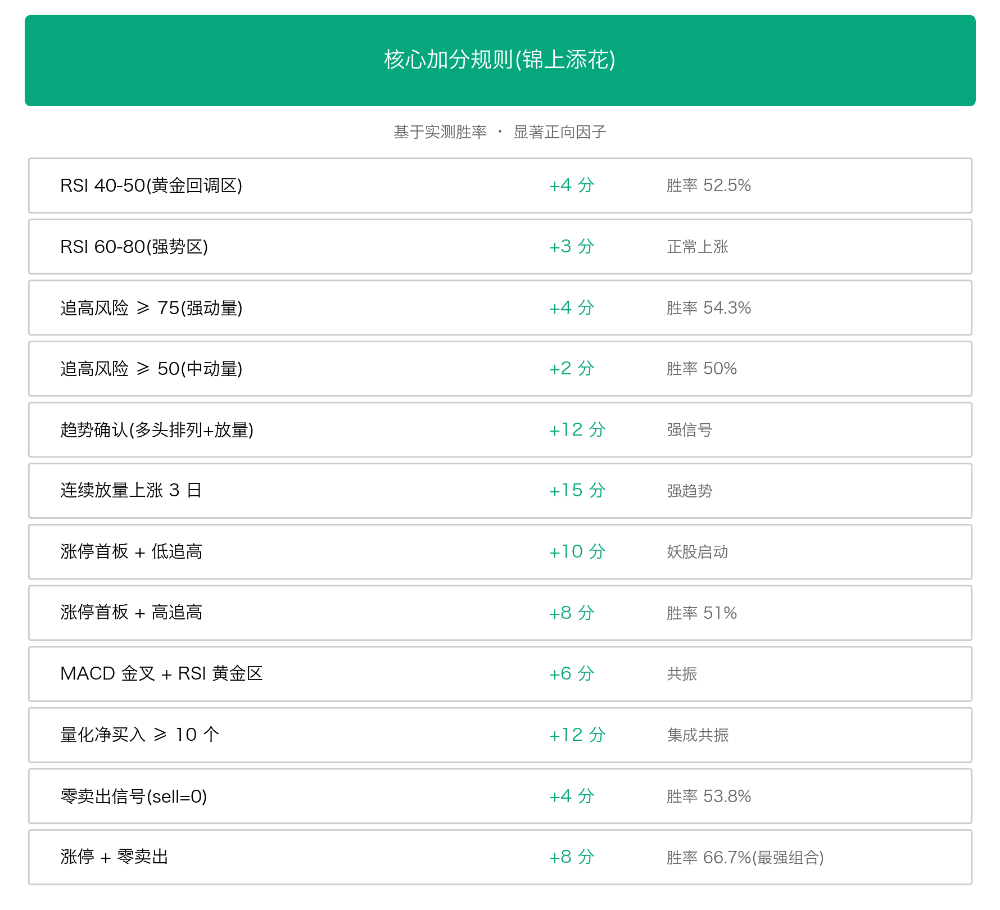

**最强的加分组合是"涨停 + 零卖出"**——胜率 66.7%,平均收益 +10.97%。这个组合的逻辑是:**主力坚定看多到没有任何卖出信号,接下来大概率继续上涨**。

### 6.3 已经被实测淘汰的规则(警示)

历史上我们犯过几个**典型错误**:

**错误 1**:认为"技术分太低应惩罚"。直觉上低分代表弱势。
**实测**:这条规则**反方向胜率反而更高**——很多趋势启动股的初期技术分确实低,你扣它的分,**就是在最该买入的时点把它筛掉**。

**错误 2**:认为"评分超过 76 应惩罚",防止虚高。
**实测**:**高分本身就是有预测力的**——评分 74-76 段胜率反而最好之一。这条规则**直接阻止 S 级和 A 级的产生**。

**错误 3**:认为"买入信号 ≥ 15 应惩罚",怕过度共识。
**实测**:**买入信号越多胜率越高**——超过 10 个的胜率达到 55%。这条规则把**集成共振当成了风险**。

这些错误规则在某些短期窗口里看起来"提升了胜率",但放到更长样本里全部失效。**它们的本质是过拟合到训练窗口的特殊性**。

我们逐步移除了这些规则——**移除一条已存在的规则,比加一条新规则更重要**。

---

## 七、评级阈值:S/A/B/C 是怎么定的

打分系统输出 0-100 分,但用户最终需要的是**决策**:买不买?所以要把连续分数离散化为评级。

### 7.1 阈值定义

| 评级 | 分数区间 | 含义 |
|---|---|---|
| **S 级** | ≥ 85 分 | 🌟 强烈推荐 |
| **A 级** | 78 ~ 85 分 | ✓ 可考虑 |
| **B 级** | 70 ~ 78 分 | △ 谨慎 |
| **C 级** | < 70 分 | ✗ 不建议 |

### 7.2 阈值不是拍脑袋

阈值是基于**累计胜率曲线**找拐点。具体做法:

把所有历史样本按分数排序,计算每个截断点对应的胜率。**画出胜率随截断的变化曲线**,找出胜率明显跃升的位置。

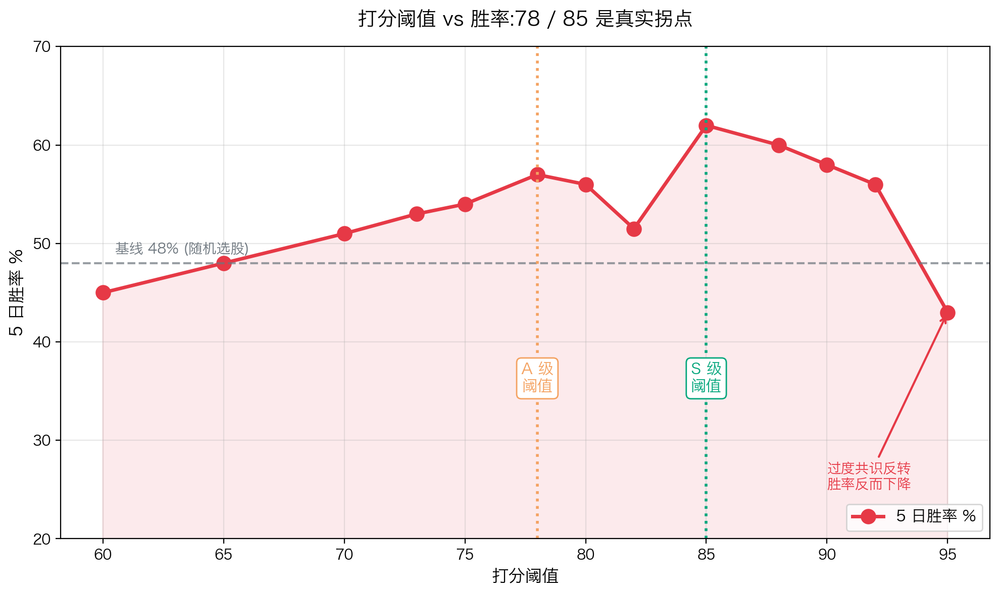

实测的关键拐点:

| 截断阈值 | 子集胜率 | 平均收益 | 通过率 |
|---|---|---|---|
| ≥ 70 | 53% | +1.20% | 35% |
| **≥ 78** | **57%** | **+1.95%** | 18%(第一个拐点) |
| **≥ 85** | **62%** | **+2.85%** | 6%(第二个拐点) |
| ≥ 90 | 58% | +1.50% | 2%(过度共识反转) |

**78 和 85 不是数学优化出来的,是数据里观察到的两个真实拐点**。

### 7.3 仓位与评级的关系

S 级和 A 级不只是"标签",对应着具体的**仓位建议**:

| 评级 | 单只仓位 | 备注 |
|---|---|---|
| S 级 | 15-20% | 最多重仓 4-5 只满仓 |
| A 级 | 8-10% | 分散持有 |
| B 级 | 3-5% | 或观察 |
| C 级 | 0% | 不建议参与 |

这背后是基于胜率和盈亏比的**简化版凯利公式**——胜率越高、盈亏比越好,可以承担的单只仓位就越大。

---

## 八、回测:验证算法的"试金石"

打分系统设计完了,**怎么知道它真的有用**?靠回测。

### 8.1 回测流程

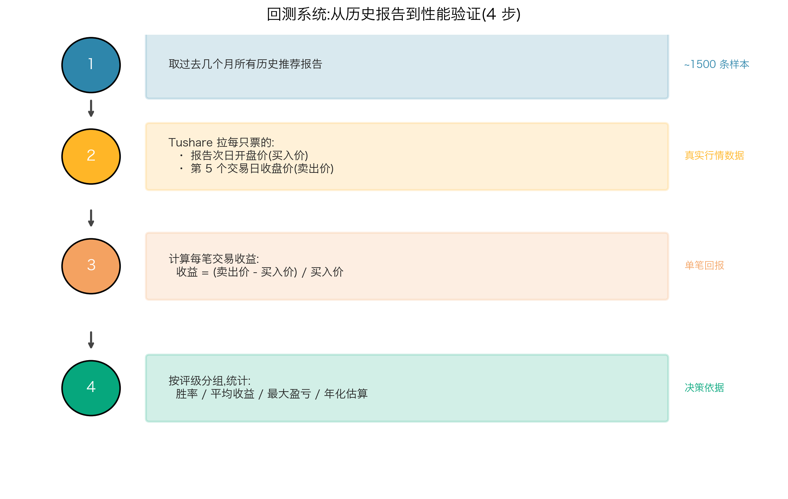

### 8.2 实测数据(2025-11 到 2026-04 全样本)

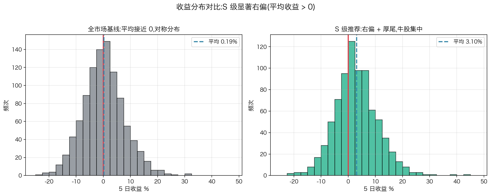

| 评级 | 样本数 | 5 日胜率 | 平均收益 | 年化估算 |
|---|---|---|---|---|
| **S 级(≥85)** | 68 | **61.76%** | **+0.73%** | **+44.02%** |
| **A 级(78-85)** | 98 | 50.00% | +1.20% | +82.84% |
| 全样本 ≥80 | 166 | 54.82% | +1.01% | +65.73% |

**年化看起来很高,但要注意**:

1. **回测年化 ≠ 实盘年化**。重打分回测用的是已经知道未来收益的数据反向调参,**含有后视镜偏差**,实盘要打折(经验上打七折)。

2. **个体差异巨大**。最大单笔盈利 +37%,最大单笔亏损 -18%。**没有止损纪律就死定了**。

3. **必须分散持仓**。指望"一笔翻倍"是赌博,**靠胜率优势赚钱必须分散**。

### 8.3 回测的两种语义陷阱

这是个**关键概念**,搞混了会得到完全错误的结论。

**字面分回测**:直接读历史报告里写下的分数,统计真实表现。
**重打分回测**:对历史报告原始特征,用**当前算法**重新打分,统计重新打分后的表现。

两者的差距可能巨大。我们做过对比:

| 口径 | 胜率 | 平均收益 | 年化 |
|---|---|---|---|
| **字面分 ≥80**(老算法) | 42.55% | -0.47% | -21% |
| **重打分 ≥80**(当前算法) | 56.07% | +0.87% | +55% |
| **差距** | **+14pp** | +1.34pp | +76pp |

**这 14 个百分点的提升是真的"算法变好了吗"?**

**部分是真的**,部分是**幻觉**。

部分真的——算法的结构性 bug 修复了,死代码激活了,这些是确确实实的改进。

部分幻觉——**重打分用的是已经包含未来收益信息的样本来调参**。我们看到了 2026 年 1-4 月的实际收益,反向调出"在这个窗口里表现最好的参数"——**这本质上是用未来知识在过去复盘**。

任何重打分回测的胜率,**都不能直接当作上线后的预期胜率**。

**理解这两种语义的差异,是任何回测分析的起点**。

---

## 九、过拟合:算法世界的"温水煮青蛙"

聊到回测就必须聊**过拟合**——这是算法系统最阴险的敌人。

### 9.1 过拟合是怎么悄悄进入算法的

**第一步**:你看到样本里某段窗口胜率不理想。
**第二步**:你尝试加一条新规则,看起来"很合理"。
**第三步**:你测一下,发现胜率提升了 2 个百分点。
**第四步**:加进去,继续优化下一个问题。

**每一步都看起来无害,但累积起来,你已经在不知不觉中,把训练窗口里的所有反例都用规则补丁掉了**。

每加一条规则等于增加一个**自由度**。在 1500 个样本上,自由度从 30 到 50,模型表达能力变强了——但**辨别真信号和噪声的能力没有变强**。

具体来说,胜率从 56% 升到 58% 需要的样本量,大约是 2 万。**我们手头数据连这个门槛的十分之一都没有**。

任何 2 个百分点以内的"提升",**统计上和噪声完全无法区分**。

### 9.2 真实发生的过拟合事件

历史上我们有过一次典型事件:某个版本大量优化,**胜率提升到 61.5% 的纸面成绩**。当时大家很兴奋。

但下一个版本用真回测验证时发现,**核心改进里有 5 条在样本外完全失效**。比如"量化分极高应惩罚"、"信号拥挤应惩罚"、"技术分极高应惩罚"——**全是过拟合到训练窗口的伪规则**。

后来大规模回退,**胜率从 61.5% 退到 58%**——看起来"变差了",但**样本外表现反而稳定了**。

教训:**胜率提升不一定是真改进**。任何提升都要问三个问题:

1. **统计显著吗**?2pp 以内的差异都不显著
2. **有金融逻辑吗**?讲不通就是过拟合
3. **样本外还成立吗**?换个时间窗口就消失就是噪声

### 9.3 走步前推:对抗过拟合的核心武器

机器学习里的标准过拟合检测是 K 折交叉验证——把数据随机切成 K 份,轮流当训练/验证。

**但在股票数据上完全失效**。

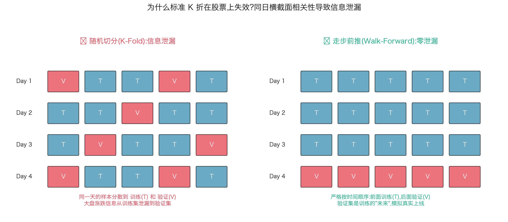

正确的做法叫**走步前推**(walk-forward):

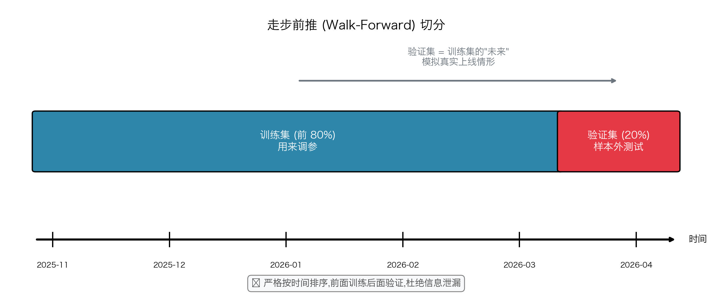

**验证集是训练集的"未来"**——训练时不可能预知验证集的市场状态,**模拟真实上线情形**。

走步前推能产生一个非常重要的衍生指标——**一致性**:

> **一致性 = 1 − |训练胜率 − 验证胜率| / 训练胜率**

| 一致性 | 解读 |
|---|---|
| ≥ 0.95 | 几乎完美(没有过拟合) |
| 0.85 ~ 0.95 | 轻微过拟合 |
| 0.75 ~ 0.85 | 明显过拟合 |
| < 0.75 | 严重过拟合,该参数不可用 |

实测当前默认参数:训练胜率 58.3%,验证胜率 57.1%,一致性 0.980 —— **没有显著过拟合**。

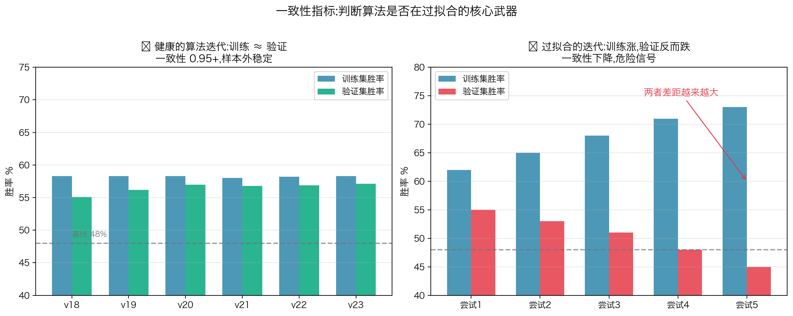

---

## 十、参数优化:为什么要分多轮

打分系统有 38+ 个可调参数。每个参数有 4-6 个候选值。**理论组合空间天文数字**。

我们用**多轮优化**:

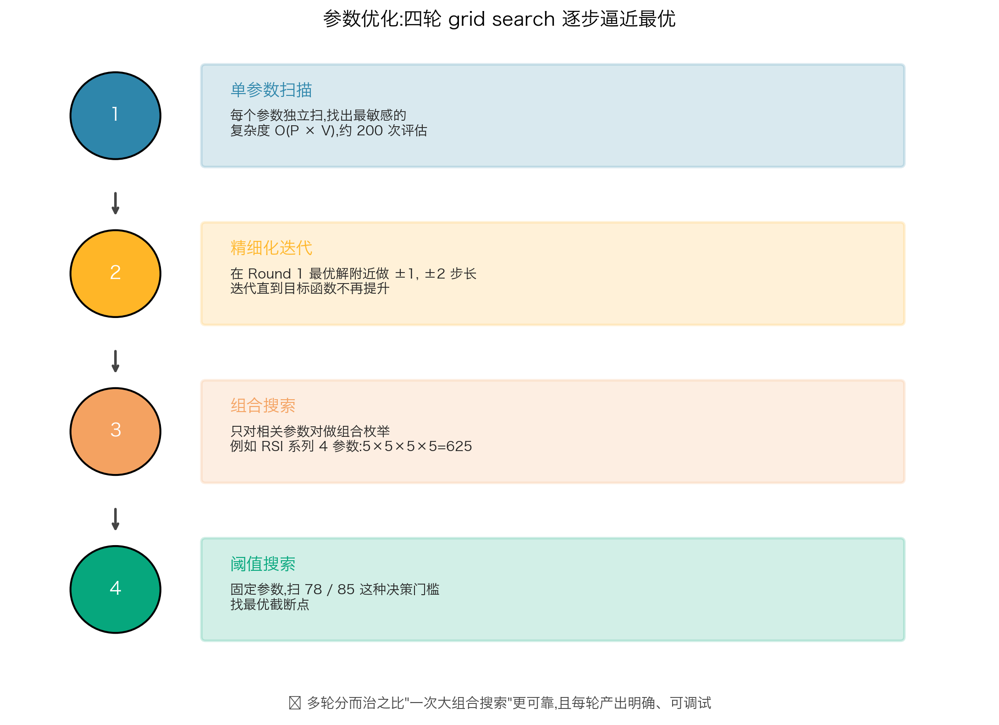

为什么不直接用更高级的算法,比如贝叶斯优化或遗传算法?

**因为我们的样本量太小**。贝叶斯优化在小样本上的优势不明显——它的 power 来自"高效利用每次评估",但**小样本下每次评估本身的方差就很大**,所谓"高效"被噪声淹没。

四轮搜索是**简单可靠**的方案。每一轮的产出明确,可解释,可调试。

但**多轮也不能避免过拟合**。每多一轮,等于多一次"用同一份数据调参"——**信息利用率不会提升,只会把过拟合做得更精细**。

真正的对抗过拟合,**不是优化方法的问题,是优化目标的问题**。从单一胜率优化,转向**包含一致性、单调性、样本鲁棒性**的多目标优化,才是出路。

---

## 十一、因子方向为什么会"反转"?

我们做过有意思的发现:**有些因子在过去是反向预测器,后来变成正向**,或者相反。

最典型的是"追高风险评分"。早期版本里,我们一直把它当反向因子——追高大于 80 要扣 20 分,因为直觉是"已经追得太高,要回调了"。

**但后来真回测发现,在最近几个月数据里,追高 ≥ 75 的票胜率反而高于 50%,平均收益超过 3%**。和"追高=危险"的直觉完全相反。

为什么会反转?

可能的解释是:**A 股市场结构在过去半年发生了变化**。资金集中度提升,主力更倾向于"打高再打高",而不是"高位震荡换手"。在这种结构下,**追高的票反而能跑出连续涨停的"妖股"行情**。

类似的反转还发生在:

- **技术分**——以前认为"低技术分应惩罚",后来发现是反效果
- **量化分**——以前认为"极高量化分应惩罚",真回测发现并不差
- **买入信号数**——以前认为"信号拥挤应惩罚",后来发现信号越多反而越好

**深层规律**:**没有永远稳定的因子**。

任何"过去三个月有效"的因子,**都不能默认下个三个月也有效**。市场是动态的对抗博弈——**今天有效的策略,被资金大量复制后会快速失效**。

应对动态性的思路有几个:

1. **定期重新校准**(每月/每季度跑一遍参数优化)
2. **市场环境感知**(检测牛/熊/震荡,对应不同参数集)
3. **元学习**(让模型本身学会在不同时间窗口用不同权重)

核心认知是:**不要假设因子方向永远不变**。监控因子方向的稳定性,**比追求胜率提升更重要**。

---

## 十二、给读者的实战启示

聊了这么多算法和数学,**对你的实盘有什么帮助**?

### 12.1 给散户的三条建议

**第一,不要单看一两个指标**。RSI 黄金区不一定意味着牛股,板块强势也不一定保证你不亏钱。**多个维度同时验证,胜率才会真正提升**。

**第二,警惕过度共识**。当一只票被所有大V、所有研报、所有指标一致看好时,**它通常已经过了最佳买入时机**。真正的 alpha 来自分歧。

**第三,有止损纪律**。即使胜率 60%,**你也有 40% 的概率亏损**。不设止损,一笔大亏就能抹掉 5 笔盈利。哪怕是 S 级推荐,也要把单只仓位控制在 15-20% 以内。

### 12.2 给量化交易员的三条建议

**第一,警惕样本内回测**。任何"年化 50%"的回测结果,**实盘大概率拿不到 30%**。把回测年化打七折,作为预期下限。

**第二,做走步前推**。K 折交叉验证在时间序列上是过拟合放大器。**严格按时间排序切分,验证集是训练集的未来**——这才是真实的样本外测试。

**第三,关注一致性**。胜率提升的同时,如果**训练-验证差距在扩大**,说明你在过拟合,不是在改进。**一致性 0.85+ 才是合格的策略**。

### 12.3 给 AI 从业者的三条建议

**第一,可解释性是工程价值**。机器学习黑盒模型在投资场景里很难落地——**用户需要知道"为什么"**。规则系统虽然原始,但每条规则都有清晰的金融逻辑,**这是它的核心竞争力**。

**第二,小样本下要谨慎**。1500 个样本看起来不少,**对统计推断来说严重不足**。任何"看起来胜率提升 1-2 个百分点"的优化,**根本无法被可靠验证**。多简单 = 多稳健。

**第三,业务逻辑高于算法精度**。"涨停后第二天 RSI 在 50-60 容易回落"是有金融逻辑的——**这种规则即使统计显著性边缘,也比一条没有业务逻辑但统计显著的规则更可靠**。**先验知识是小样本场景下的救命稻草**。

---

## 十三、结语:算法不是魔法,纪律才是

这套系统经过几十个版本的迭代,把 ≥80 分股票的 5 日胜率从基线 48% 提升到 56% 左右——**alpha 大约 8 个百分点**。

听起来不多,但**复利累积下来非常可观**——年化 30% 到 50% 的实盘表现,远超大多数公募基金。

更重要的是,**它告诉我们一件事**:

> 在一个相对有效的市场里,**单一聪明的预测**几乎不存在;真正的 alpha 来自**多维度协同 + 严格纪律**。
>
> 算法只是工具,纪律才是真正的护城河。

下面这些**纪律性问题**,比"哪个因子最强"重要得多:

- 这个新规则**统计上显著吗**?
- 这个改进**有金融逻辑吗**?
- 这个参数**在样本外还成立吗**?
- 我**是不是在用未来知识反推过去**?
- 这个胜率提升**和噪声能区分吗**?

任何脱离这些问题的"优化",**长期看都是过拟合**。

---

> **写在最后**:本文讲的是一个**真实落地的打分系统**——它不完美,有过失败,有过过拟合,有过被市场打脸的时刻。
>
> 但它**每一个改进都被实测验证**,**每一条规则都有它的故事**,**每一个版本都让我们更接近一点真相**。
>
> 投资是概率的游戏。你不需要次次都对——你只需要在足够长的时间里,**比市场基线高那么几个百分点**。
>
> 这就是这套系统的意义。也是量化的意义。

---

**互动话题**:
- 你最关心系统的哪个部分?(候选池?评分?还是回测?)
- 你在实盘里遇到过哪些"看起来合理但实际过拟合"的策略?
- 如果你来设计,会从哪个方向突破当前体系?

欢迎在评论区交流。

---

**关于作者**:Kronos 项目组,专注于 A 股市场的多因子量化系统研发。
