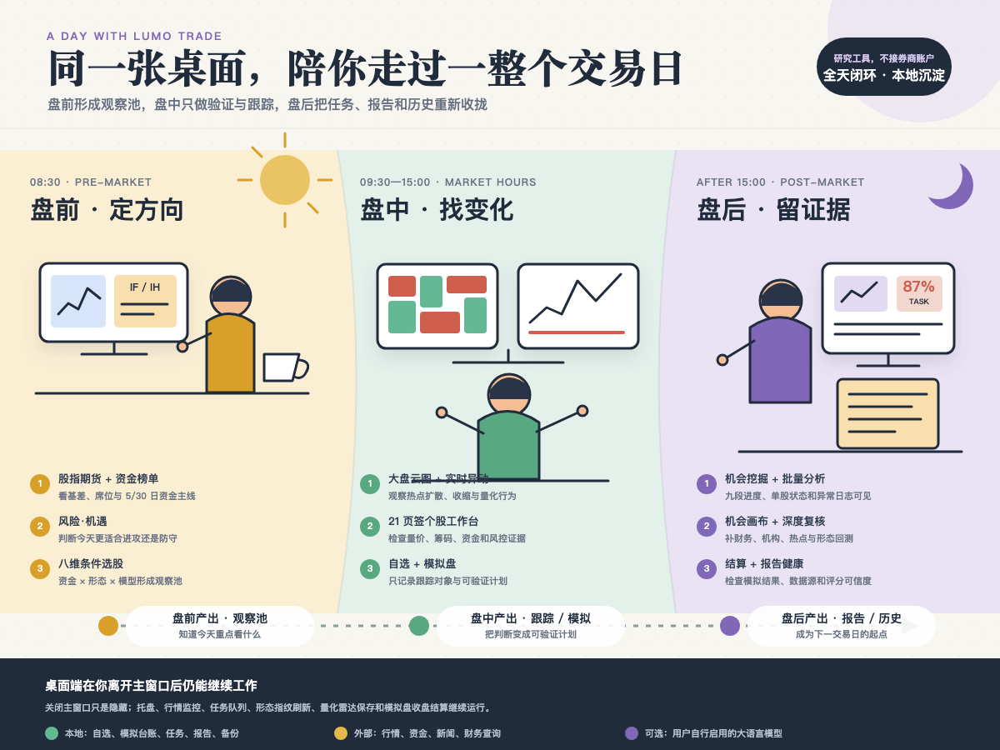

# Lumo Trade 桌面端完整指南

> **文档类型**: 项目功能说明
> **适用对象**: 使用与开发 Lumo Trade 桌面包的开发者 / 研究员
> **基准版本**: Lumo Trade 桌面包 v1.1.6
> **最后更新**: 2026-09-12

---

## ① 它是什么

很多投资工具只解决一个局部问题：行情软件负责看盘，选股器负责筛选，量化脚本负责跑信号，新闻终端负责追热点，
表格负责记持仓——最后还得靠人肉把这些信息拼成结论。

**Lumo Trade 想解决的是另一类问题：** 能不能把"观察市场 → 发现机会 → 研究个股 → 识别风险 → 模拟执行 →
跟踪复盘"放在同一套桌面工作流里，并且让所有数据、任务和报告尽量留在本机？

它不是单纯的 K 线预测器，也不是只打几个分数的选股页面，而是一套面向 A 股研究场景的**本地智能投研控制台**。

| 指标 | 数量 |
|------|------|
| 桌面页面 | 15 个 |
| 个股分析页签 | 21 个 |
| 后端 API 路由 | 117 个 |
| 量化模型 | 30 个 |
| 自动化测试 | 129 个测试文件 |

---

## ② 投研链路：六个环节首尾衔接

```
市场全景  →  候选池  →  分层评分  →  个股深研  →  风控决策  →  沉淀复盘
  ①             ②           ③            ④            ⑤             ⑥
```

1. **建立市场全景** — 通过总览、大盘云图、资金榜单、量化雷达、股指期货和实时资讯了解当日市场状态。
2. **形成候选池** — 多源机会挖掘引擎、热门板块/东财热榜、主力资金流向 Top N、八维条件选股器。
3. **分层评分** — 机会挖掘引擎采集行情/资金/基本面/新闻/情绪/板块，调用评分规则与 30 个量化模型，产出可追溯的综合评分与评级。
4. **个股深研** — 任何股票一键打开 21 个页签的股票工作台。
5. **行动与风控** — 风险·机遇页面把机会分与四层风险放到同一决策大屏；模拟盘低成本验证策略。
6. **沉淀复盘** — 后台任务、报告库、机会历史、股票池/板块池、形态回测、SQLite 数据仓库。


*投研六步链路：市场全景 → 候选池 → 分层评分 → 个股深研 → 风控决策 → 沉淀复盘*

---

## ③ 15 个桌面页面

### 1. 总览

打开应用后的第一个画面，回答三个问题：**市场现在怎样、系统是否可用、下一步从哪里开始**。

- 上证指数、监控股票数量、最新机会数量三项核心指标
- 个股快搜（按代码或名称直达个股分析）
- 实时异动列表
- 新浪 7×24 / 东方财富 7×24 / 同花顺电报等资讯入口
- 东方财富热榜与板块动量
- 系统状态提示（市场、任务、配置、数据源）

### 2. 大盘云图

全市场股票按行业聚合，**矩形面积代表成交额，红绿颜色代表涨跌**。

- 覆盖上证指数、深证成指、创业板指、中证全指、上证 50、沪深 300、中证 500 等
- 全部 / 上涨 / 平盘 / 下跌四态过滤
- 实时行情 + 指定交易日历史回溯
- TuShare → 东方财富 → 新浪 → 本地热门快照，四级数据源自动降级
- 点击板块 → 成分股，点击股票 → 个股工作台

### 3. 风险·机遇（决策统筹层）

消费机会挖掘、资金榜单、市场环境、自选和模拟持仓的已有结果，再叠加四层风险：

| 风险层级 | 关注点 |
| --- | --- |
| 市场系统性风险 | 指数趋势、波动率、流动性 |
| 板块拥挤风险 | 行业资金集中度、热度偏离 |
| 个股自身风险 | 追高、筹码、基本面异变 |
| 持仓组合风险 | 模拟持仓的集中度和相关度 |

核心区域：市场风险/机会/情绪三项综合指数、**风险与机会撮合矩阵**（横轴机会分、纵轴风险分，四象限）、
行业热力与板块拥挤度、资金主线榜/机会榜/持仓与自选风险榜。

> ⚠️ 风险·机遇页面如出现算法标签，不应让具体股票名称、代码或个人持仓与指令化标签同屏展示。

### 4. 资金榜单

包含三个工作模式：**主力净流入榜、龙虎榜、量化交易分析**。

- 单日/多日聚合，5 日/30 日资金窗口
- "无量化"过滤，剔除量化参与明显的股票
- 多选股票一键调用机会挖掘分析
- 量化温度计、活跃板块/股票榜、收割预警、20/40/60 日吸筹埋伏榜、个股量化行为深评

### 5. 股指期货

覆盖中金所四大股指期货（IF 沪深300 / IH 上证50 / IC 中证500 / IM 中证1000）。

- 期货实时行情 + 现货指数 + 基差与贴水率
- 前 20 席位：多单榜、空单榜、会员净持仓榜、成交量榜
- 多空持仓趋势图（近 10 日）
- 透明信号规则（多增空减偏多、空增多减偏空、双增分歧、双减离场）

### 6. 条件选股（八维 AND 组合）

**留空条件不参与筛选，填写了的条件之间取 AND 交集**。

| 维度 | 可选条件 |
| --- | --- |
| 行情快照 | 涨跌幅、价格、换手率、板块、排除 ST/涨停 |
| 主力资金 | 当日主力净流入、净流入率、连续净流入天数 |
| 盘口异动 | 量化活跃度、异动笔数、拉抬、砸盘预警 |
| 主力吸筹 | 20/40/60 日窗口、吸筹判定、埋伏评分 |
| 龙虎榜 | 最近 1/3/5/10 日上榜、累计净买入、量化席位 |
| 机会评分 | 最新机会挖掘综合评分 |
| 技术形态 | 站上 MA20、MA5>MA10>MA20、20 日新高、MACD/KDJ 金叉、RSI 区间、量比 |
| 量化模型 | 30 个模型按最新 K 线的买入票数和卖出票数 |

### 7. 分析工作台

机会挖掘、批量分析和历史复盘的主操作区，可发起机会挖掘（候选数量/并发/候选来源）与批量分析（策略 + 并发），
并查看最新机会列表、K 线、量化模型摘要、板块热点、历史挖掘等。内含**投资机会画布**（七种组织方式）：
层级 / 排名 / 板块 / 标签 / 热门 / 资金 / 龙虎榜。

### 8. 挖掘引擎

把运行过程拆成**可见阶段**，消除"旋转图标"黑盒：

- 候选收集 → 数据准备 → 多智能体并行分析 → 评分排序 → 报告生成 → 结果入库
- 总体进度环、阶段轨道、并行工作单元状态、实时日志、成功/跳过/失败计数
- 可手动启动新任务，也可**自动接管已在后台运行的任务**

### 9. 形态搜股

**手绘形态** 或 **个股形态** 两种输入，系统使用**本地形态指纹库**做相似度检索，返回相似股票列表与曲线叠加对比；
可对相似股 Top 20 做近一年回测（5/10/20 日胜率与平均涨幅）。

### 10. 自选与提醒

自选页支持添加/删除/置顶/刷新；提醒按固定周期扫描价格突破、涨跌幅阈值、盘口异动、量化活跃度等。
底部常驻**实时热点条**六类信息流：🔥 热点 / ⚡ 异动 / ⭐ 自选 / 📊 板块 / 📰 快讯 / 🔔 系统。

### 11. 模拟盘

默认以**本地账户台账**运行，撮合用日 K 近似（非分时盘口），费用进入成本计算。

- 现价买入 / 次日开盘价买入 / 指定价格买入、导入历史买入、待撮合委托 + 撤单
- 持仓盯市 + 成交流水 + 操作日志、权益曲线、收益统计、胜率分析、当日结算与复盘
- 后台"模拟盘自动跟单（仅写本地模拟台账）"：机会报告达最低评分档的可按次日开盘价自动建模拟持仓

> 这项功能只写模拟台账，不触碰真实账户。

### 12. 星轨图谱

**可编辑的主题研究工具**，默认以"物理 AI / AI 产业链"建立多层同心轨道（外层近应用/终端，内层近基础设施）。
可新建/修改/删除轨道环、从东财概念或行业板块搜索加入、钉选个股、切换星轨/列表视图、恢复默认主题。轨道/板块/
个股/成员关系全部进入本地 SQLite。

### 13. 报告与健康

集中展示本地生成的机会/批量分析/个股报告，同时展示评分算法健康度、历史回测状态（覆盖率/样本量/显著性）、
模块导入与运行健康、数据源诊断与降级信息。

> 金融工具最危险的状态不是"没有数据"，而是**用过期数据或降级数据得出看似正常的结论**。把检查放进产品界面，
> 让用户时刻知道自己看到的结果从哪里来。

### 14. 后台配置

| 配置区 | 内容 |
| --- | --- |
| AI 分析模型 | 选择启用的模型、配置各 Provider 的 API Key、查看配置文件路径 |
| TuShare 数据源 | 配置 Token、请求超时和重试次数，可显式清空；部分数据接口需要 5000 积分，注册与积分门槛说明见 [README「快速开始」](../../README.md#快速开始) |
| Kronos 模型 | 查看模型运行时可用性，选择 auto/CPU/MPS/CUDA 设备，按需载入 |
| 数据与模拟盘 | 模拟跟单参数；导出/导入整库 SQLite 快照（自动备份 + Schema 迁移） |

### 15. 关于与合规

明确列出免责声明、使用条款、数据来源和版本信息。首次启动弹出风险提示，用户确认后才进入主工作区。

---

## ④ 跨越页面的全局能力

### 股票工作台（21 个分析页签）

个股分析是一个**全局弹窗**，任何页面中的股票代码、榜单行、K 线、画布节点或自选项都可一键打开。

| # | 页签 | 职责 |
| --- | --- | --- |
| 1 | 快速信息 | 基础行情、所属板块、近期状态、快捷操作 |
| 2 | 综合总览 | 多维雷达、关键结论、数据完整性、综合信号 |
| 3 | 市场周期 | 股票所处趋势与周期阶段诊断 |
| 4 | 主力阶段 | 资金行为所处阶段判断 |
| 5 | 量价博弈 | 成交量与价格关系分析 |
| 6 | 筹码结构 | 筹码集中度、成本和结构状态 |
| 7 | 业绩预期 | 收入、利润、ROE 等基本面与预期指标 |
| 8 | 概率推演 | 多情景概率与未来路径推演 |
| 9 | 操盘风控 | 关键风险、退出情景和仓位约束参考 |
| 10 | 涨停筛选 | 强势形态、连板和涨停相关信号 |
| 11 | 主力深度 | 更细粒度资金与机构行为数据 |
| 12 | 资金榜单 | 个股在各资金榜和龙虎榜中的位置 |
| 13 | 量化矩阵 | 30 个模型信号的矩阵化展示 |
| 14 | 筹码·控盘雷达 | 控盘度雷达和筹码维度分析 |
| 15 | 机构持仓 | 基金、股东、北向和机构调研等持仓信息 |
| 16 | 多空评审团 | 七种投资流派的结构化评审 |
| 17 | AI 解读 | 调用用户配置的大语言模型生成分析 |
| 18 | 财务三大表 | 资产负债表、利润表、现金流量表 |
| 19 | 形态回测 | 相似形态的历史后续表现统计 |
| 20 | 关联热点 | 个股 × 板块 × 星轨图谱的三层关联新闻 |
| 21 | 量化行为 | 盘口异动、活跃度、砸盘、吸筹等量化行为分析 |

### 全局任务队列

机会挖掘和批量分析不会阻塞页面。每个后台任务拥有唯一 ID、状态、创建时间、实时日志和结果链接。

### 全局报告抽屉

任何页面可打开报告抽屉查看最新报告、类型、更新时间与大小，并在应用内预览 Markdown / HTML。

### 系统托盘与行情弹窗

关闭主窗口默认**隐藏而非退出**。托盘左键展开 360×520 行情弹窗（自选/热点/板块/异动/快讯/快捷入口），
右键菜单可打开控制台、刷新行情或退出。

### 自动收盘维护

收盘后自动执行形态指纹库刷新检查、量化雷达榜单保存、模拟盘结算与复盘，不依赖应用前台运行。

### 数据备份与迁移

支持一键导出整库 SQLite 快照或导入数据库替换当前数据。导入前自动备份并从旧 Schema 迁移。

---

## ⑤ 技术架构概要

Lumo Trade 让每一层承担适合自己的职责：

```
┌──────────────────────────────────────┐
│           Tauri 2 (Rust)             │  ← 桌面壳：窗口、托盘、通知、外部链接
├──────────────────────────────────────┤
│   Jinja2 模板 + 原生 JS + Plotly     │  ← 前端：服务端渲染，无重型框架
├──────────────────────────────────────┤
│       Robyn (Python, 8 Workers)      │  ← 本地 API：117 个路由，按业务域编排
├──────────────────────────────────────┤
│  规则引擎 + 30 量化模型 + Kronos AI  │  ← 分析层：规则、模型、LLM 三层并存
├──────────────────────────────────────┤
│          SQLite (WAL 模式)            │  ← 数据层：本地持久化中心，多域统一存储
├──────────────────────────────────────┤
│  TuShare / AKShare / 东财 / 新浪 …   │  ← 数据源：多源获取，明确降级路径
└──────────────────────────────────────┘
```

**分析层**三个组成部分各司其职：

- **规则与评分引擎**：可解释的机会评分、风险因子、技术形态和资金信号
- **30 个量化模型**：投票和热度统计，用于选股、机会分析和个股量化矩阵
- **Kronos 金融基础模型**：K 线序列建模与预测，支持 CPU / CUDA / Apple MPS
- **大语言模型**：个股解读、报告和评审团覆盖层，Provider 和 Key 由用户配置

这种分层设计避开两个极端：所有输出来自不可解释的黑盒，或者模型不可用就导致产品瘫痪。
**数据源**预设主源 → 备源 → 本地缓存的回退路径，实时源失败时明确标注"数据不可用 / 已回退 / 仍使用历史数据"。


*五层技术架构：Tauri（桌面壳）→ Robyn（本地 API）→ 分析层 → SQLite → 多源数据*

---

## ⑥ 一套实际可执行的工作流

### 🌅 盘前

1. 打开**股指期货**，查看 IF/IH/IC/IM 基差、席位多空和近几日持仓趋势。
2. 打开**资金榜单**，看最近 5 日和 30 日资金主线——哪些行业在持续吸金。
3. 在**风险·机遇**页面确认市场风险指数和已有持仓风险——今天适合进攻还是防守。
4. 用**条件选股**组合资金、技术形态和量化信号，产出一份盘前观察池。

### 🔴 盘中

1. 用**大盘云图**观察热点是扩散还是收缩。
2. 用实时异动和**量化雷达**发现拉抬、砸盘、活跃板块和异常股票。
3. 点开**个股工作台**检查量价、筹码、资金流向和风控页签。
4. 把需持续跟踪的股票加入**自选**；必要时在**模拟盘**记录操作计划。

### 🌙 盘后

1. 启动**机会挖掘**或指定股票池的批量分析。
2. 在**挖掘引擎**页面观察阶段进度、失败项和异常日志。
3. 通过**机会画布**从板块和资金维度审阅当日的股票-板块关系。
4. 对重点标的翻财务三大表、机构持仓变化、关联热点和形态回测。
5. 运行**模拟盘结算**和当日复盘——胜率、盈亏比、最大回撤。
6. 在**报告与健康**页检查新报告、数据源状态和评分健康度。


*盘前 → 盘中 → 盘后的一条完整投研工作流*

---

## ⑦ 系统边界：它不会替用户做什么

- 📊 评分、回测、形态相似度和 AI 解读 **不代表未来收益**
- 🔍 吸筹、主力、控盘、情绪和风险等指标来自公开数据和算法代理，**不是对真实交易主体意图的确定识别**
- 📝 模拟盘使用日 K 近似撮合，**不能复现真实分时流动性、滑点和冲击成本**
- ⚠️ 数据源可能延迟、缺失或改变接口——留意页面中的数据时间戳和来源标注
- 🤖 大语言模型可能产生错误解释——最终结论应回到原始数据和可解释规则
- 📜 用户应自行遵守数据提供方条款和所在地区的法律法规

---

## ⑧ 工程状态

截至本文，`tests` 目录下有 **129 个** `test_*.py` 文件，覆盖后端路由、任务、数据库、资金榜单、量化雷达、
模拟盘、形态检索、个股套件、授权、桌面模板和报告等模块。

技术路线可以概括为：

> **Tauri 负责桌面生命周期，Robyn 负责本地 API，Jinja2 和原生 JavaScript 负责界面，SQLite 负责持久化，
> 规则与模型共同负责分析，多数据源和缓存负责韧性。**

不追求把所有事情塞进一个巨大模型，而是让每一层承担适合自己的职责。

---

> ⚠️ **免责声明**：本文所述功能以 Lumo Trade 桌面包 v1.1.6 及相应项目代码为准。软件提供的行情、指标、评分、
> 模型结果和文字解读仅供研究与学习参考，不构成投资建议。股市有风险，投资需谨慎。