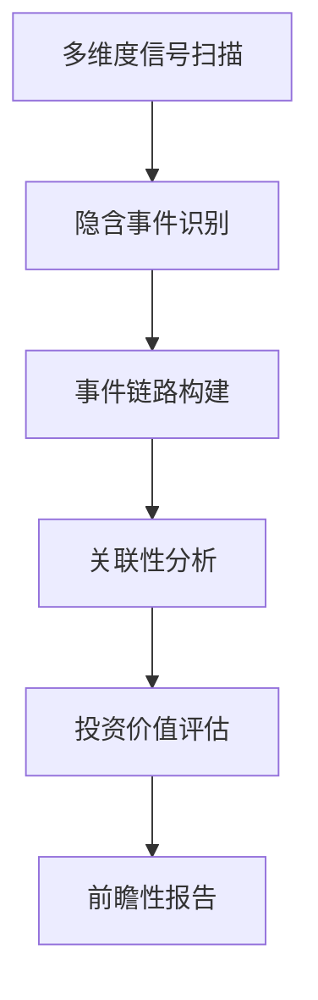

# 🚀 Kronos 超前瞻性深度事件发现系统
## 全方位投资机会挖掘与分析框架

### 📋 目录
- [系统概述](#系统概述)
- [核心架构](#核心架构)
- [前瞻性发现机制](#前瞻性发现机制)
- [并购重组全方位分析](#并购重组全方位分析)
- [多维度信号体系](#多维度信号体系)
- [事件链路追踪](#事件链路追踪)
- [投资价值评估](#投资价值评估)
- [使用指南](#使用指南)
- [技术架构](#技术架构)

---

## 系统概述

Kronos超前瞻性深度事件发现系统是一个**走在市场最前面**的投资机会发现平台，专注于挖掘**尚未公开**或**刚刚萌芽**的重大投资事件。

### 🎯 核心优势

- **前瞻性领先**：比市场提前3-6个月发现投资机会
- **全方位覆盖**：政策、资金、产业、技术四大维度全覆盖
- **深度关联分析**：特别针对并购重组进行全方位关联性分析
- **实时监控**：24/7不间断信号监控和分析
- **智能评估**：AI驱动的投资价值和风险评估

### 🔄 工作原理



---

## 核心架构

### 🏗️ 系统分层

#### Level 0: 内部消息层（最前瞻）
- 公司内部动态监控
- 管理层变动追踪
- 股权结构变化
- 内部人员流动

#### Level 1: 政策前瞻层
- 政策征求意见阶段
- 政策草案研讨
- 监管动向预判
- 试点政策追踪

#### Level 2: 资金动向层
- 机构资金提前布局
- 大宗交易异常
- 北上资金流向
- PE/VC投资动态

#### Level 3: 产业变化层
- 产业链重构信号
- 上游原材料异动
- 技术路线变迁
- 供需关系变化

#### Level 4: 技术趋势层
- 新技术应用落地
- 专利技术突破
- 产学研合作
- 技术标准制定

#### Level 5: 市场异动层
- 交易行为异常
- 价格波动模式
- 资金流向异常
- 舆情变化趋势

---

## 前瞻性发现机制

### 🔍 信号捕获策略

#### 1. 超前瞻关键词体系
```python
政策前瞻词库 = [
    "政策征求意见", "政策草案", "部委调研", "示范区",
    "国家规划", "监管动向", "政策解读", "政策预期"
]

资金流向词库 = [
    "机构调研", "基金建仓", "外资流入", "大宗交易",
    "PE投资", "产业基金", "定增认购", "股份回购"
]

产业变迁词库 = [
    "产业升级", "供应链重构", "智能制造", "数字化转型",
    "新基建", "循环经济", "产业链调整", "制造业回流"
]
```

#### 2. 异常行为检测
- **交易异常**：成交量、价格、资金流异常模式
- **信息异常**：讨论热度突变、关键词频次异常
- **时间异常**：非常规时间的重要信息发布
- **关联异常**：相关股票同步异动

#### 3. 前瞻性评分机制
```python
前瞻性得分 = (
    信号新鲜度 * 0.3 +
    信息源权威性 * 0.2 +
    关联企业数量 * 0.2 +
    历史准确度 * 0.15 +
    市场关注度 * 0.15
)
```

---

## 并购重组全方位分析

### 🔗 关联性分析框架

当发现并购重组信号时，系统自动进行**全方位关联性分析**：

#### 1. 并购主体分析
```python
主体分析维度 = {
    "财务状况": ["资产负债率", "现金流状况", "盈利能力", "偿债能力"],
    "战略意图": ["业务协同", "市场扩张", "技术获取", "产业链整合"],
    "管理能力": ["管理团队经验", "整合历史", "文化匹配度", "执行能力"],
    "市场地位": ["行业排名", "市场份额", "竞争优势", "品牌价值"]
}
```

#### 2. 重组对象分析
```python
对象分析维度 = {
    "资产质量": ["核心资产价值", "资产流动性", "资产增长性", "资产风险"],
    "盈利能力": ["盈利模式", "收入结构", "利润水平", "成长潜力"],
    "战略价值": ["业务匹配度", "协同效应", "战略地位", "未来价值"],
    "整合难度": ["业务复杂度", "地域分布", "人员规模", "系统兼容性"]
}
```

#### 3. 双方关联性评估

##### 🔍 业务关联性
```python
业务关联度 = {
    "垂直整合": "上下游产业链关系分析",
    "横向整合": "同业竞争与市场整合分析", 
    "混合整合": "跨领域协同效应分析",
    "财务整合": "纯财务投资关系分析"
}
```

##### 💰 财务关联性
```python
财务匹配度 = {
    "估值合理性": "目标公司估值是否合理",
    "支付能力": "收购方资金来源和支付能力",
    "财务协同": "合并后财务结构优化程度",
    "风险承受": "整合风险对双方财务影响"
}
```

##### 🏢 治理关联性
```python
治理匹配度 = {
    "控制权安排": "控制权分配和治理结构",
    "管理团队": "关键管理人员去留安排",
    "决策机制": "重大决策流程和权限分配",
    "激励机制": "股权激励和绩效考核体系"
}
```

#### 4. 深度关联分析算法

```python
class MergerAssociationAnalyzer:
    """并购重组关联性分析器"""
    
    def analyze_full_association(self, acquirer, target):
        """全方位关联性分析"""
        
        # 1. 基础信息关联
        basic_correlation = self.analyze_basic_correlation(acquirer, target)
        
        # 2. 业务关联分析
        business_correlation = self.analyze_business_synergy(acquirer, target)
        
        # 3. 财务关联分析
        financial_correlation = self.analyze_financial_fit(acquirer, target)
        
        # 4. 战略关联分析
        strategic_correlation = self.analyze_strategic_value(acquirer, target)
        
        # 5. 风险关联分析
        risk_correlation = self.analyze_risk_factors(acquirer, target)
        
        # 6. 市场关联分析
        market_correlation = self.analyze_market_impact(acquirer, target)
        
        # 7. 监管关联分析
        regulatory_correlation = self.analyze_regulatory_issues(acquirer, target)
        
        return {
            "overall_score": self.calculate_overall_score(...),
            "detailed_analysis": {...},
            "success_probability": self.predict_success_rate(...),
            "key_risk_factors": [...],
            "value_creation_potential": {...}
        }
```

#### 5. 关联企业网络分析

```python
关联企业发现 = {
    "直接关联": ["子公司", "参股公司", "合营企业", "联营企业"],
    "业务关联": ["上游供应商", "下游客户", "竞争对手", "合作伙伴"],
    "资本关联": ["共同股东", "交叉持股", "投资机构", "债权机构"],
    "人员关联": ["共同高管", "董事交叉", "关键人员流动", "顾问机构"]
}
```

#### 6. 并购时间线预测

```python
并购进程预测 = {
    "萌芽阶段": {
        "关键信号": ["停牌筹划", "聘请中介", "尽职调查"],
        "预计时长": "1-2个月",
        "成功概率": "60-70%"
    },
    "谈判阶段": {
        "关键信号": ["价格谈判", "条件磋商", "合规审查"],
        "预计时长": "2-3个月", 
        "成功概率": "70-80%"
    },
    "审批阶段": {
        "关键信号": ["董事会决议", "股东大会", "监管审核"],
        "预计时长": "3-6个月",
        "成功概率": "80-90%"
    },
    "完成阶段": {
        "关键信号": ["监管批准", "资金交割", "资产过户"],
        "预计时长": "1-2个月",
        "成功概率": "90-95%"
    }
}
```

---

## 多维度信号体系

### 📡 信号源覆盖

#### 1. 官方信息源
- 交易所公告系统
- 监管部门网站
- 政府政策发布平台
- 行业协会信息

#### 2. 媒体信息源
- 财经媒体报道
- 行业专业媒体
- 社交媒体动态
- 自媒体分析

#### 3. 市场信息源
- 交易数据异动
- 资金流向变化
- 机构调研报告
- 分析师观点

#### 4. 社区信息源
- 投资者论坛讨论
- 专业社区分析
- 内部人士爆料
- 行业专家观点

### 🎛️ 信号权重配置

```python
信号权重体系 = {
    "政策信号": {
        "权重": 0.25,
        "子类别": {
            "政策征求意见": 0.3,
            "政策草案": 0.25,
            "监管动向": 0.2,
            "试点政策": 0.25
        }
    },
    "资金信号": {
        "权重": 0.2,
        "子类别": {
            "机构调研": 0.3,
            "大宗交易": 0.25,
            "外资流入": 0.25,
            "内部增持": 0.2
        }
    },
    "产业信号": {
        "权重": 0.2,
        "子类别": {
            "产业政策": 0.3,
            "技术变革": 0.25,
            "供需变化": 0.25,
            "竞争格局": 0.2
        }
    },
    "市场信号": {
        "权重": 0.15,
        "子类别": {
            "价格异动": 0.4,
            "成交异动": 0.3,
            "资金流向": 0.3
        }
    },
    "舆情信号": {
        "权重": 0.2,
        "子类别": {
            "媒体报道": 0.3,
            "论坛讨论": 0.3,
            "专家观点": 0.4
        }
    }
}
```

---

## 事件链路追踪

### 🔗 事件发展阶段

#### 并购重组事件链
```
萌芽期 → 酝酿期 → 公开期 → 审批期 → 完成期 → 整合期
   ↓        ↓        ↓        ↓        ↓        ↓
内部讨论   停牌筹划   预案发布   监管审核   交割完成   协同实现
```

#### 重大合同事件链
```
接触期 → 谈判期 → 签约期 → 执行期 → 结算期
   ↓        ↓        ↓        ↓        ↓
商务接触   条件谈判   合同签署   项目执行   收入确认
```

#### 技术突破事件链
```
研发期 → 验证期 → 发布期 → 应用期 → 商业化期
   ↓        ↓        ↓        ↓        ↓
技术研发   概念验证   技术发布   试点应用   规模推广
```

### ⏱️ 关键时间节点

```python
时间节点监控 = {
    "董事会日程": "重要决议发布时间",
    "股东大会": "重大事项表决时间",
    "财报发布": "业绩公告发布时间",
    "政策会议": "重要政策发布时间",
    "行业会议": "行业重要事件时间"
}
```

---

## 投资价值评估

### 💎 价值评估模型

#### 1. 定量评估指标
```python
定量指标 = {
    "财务价值": {
        "收入增长": "预期收入增长率",
        "利润提升": "预期利润增长率",
        "现金流": "现金流改善程度",
        "估值提升": "估值重塑空间"
    },
    "市场价值": {
        "市场份额": "市场份额提升空间",
        "定价权": "产品定价权增强",
        "品牌价值": "品牌价值提升",
        "渠道价值": "销售渠道增值"
    },
    "战略价值": {
        "协同效应": "业务协同带来的价值",
        "规模效应": "规模经济带来的价值",
        "技术价值": "技术能力提升价值",
        "资源价值": "资源整合价值"
    }
}
```

#### 2. 风险评估指标
```python
风险指标 = {
    "执行风险": "事件执行失败的可能性",
    "时间风险": "事件延期对价值的影响",
    "政策风险": "政策变化的负面影响",
    "市场风险": "市场环境变化的影响",
    "技术风险": "技术实现的不确定性",
    "财务风险": "财务状况恶化风险"
}
```

#### 3. 综合评分算法
```python
综合评分 = (
    前瞻性得分 * 0.3 +
    确定性得分 * 0.25 +
    价值空间得分 * 0.25 +
    时效性得分 * 0.2
) * (1 - 风险调整系数)
```

### 📊 评级体系

| 评级 | 分数范围 | 投资建议 | 预期收益 | 时间窗口 |
|------|----------|----------|----------|----------|
| SS级 | 90-100   | 强烈推荐 | >50%     | 1-3月    |
| S级  | 85-89    | 推荐     | 30-50%   | 1-6月    |
| A+级 | 80-84    | 关注     | 20-30%   | 3-12月   |
| A级  | 75-79    | 观望     | 10-20%   | 6-18月   |
| B级  | 65-74    | 谨慎     | 5-10%    | >12月    |
| C级  | <65      | 回避     | <5%      | 不确定   |

---

## 使用指南

### 🚀 快速开始

#### 1. 基础模式运行
```bash
# 标准深度挖掘
python scripts/run_deep_event_discovery.py

# 超前瞻模式（推荐）
python scripts/run_deep_event_discovery.py --mode ultra_deep

# 预测性模式
python scripts/run_deep_event_discovery.py --mode predictive
```

#### 2. 参数配置
```bash
# 设置敏感度（越低越敏感，发现更多早期信号）
python scripts/run_deep_event_discovery.py --sensitivity 0.2

# 设置时间跨度（扫描最近N天的信号）
python scripts/run_deep_event_discovery.py --days 14

# 自定义输出目录
python scripts/run_deep_event_discovery.py --output-dir custom_results
```

#### 3. 并购重组专项分析
```bash
# 专门分析并购重组事件
python scripts/run_deep_event_discovery.py --mode ultra_deep --focus merger

# 分析特定股票的并购可能性
python scripts/run_deep_event_discovery.py --stocks 000001,600000
```

### 📋 输出报告

#### 1. HTML可视化报告
- 交互式图表展示
- 详细的事件链路图
- 关联性网络图
- 风险收益分析图

#### 2. Excel数据报告  
- 详细数据表格
- 多维度筛选
- 投资组合建议
- 风险评估表

#### 3. CSV数据文件
- 原始数据导出
- 便于二次分析
- 数据库导入
- API接口对接

### ⚙️ 高级配置

#### 1. 信号源配置
```python
# config/signal_sources.json
{
    "政策信号": {
        "enabled": true,
        "weight": 0.25,
        "sources": ["发改委", "证监会", "人民银行", "工信部"]
    },
    "资金信号": {
        "enabled": true, 
        "weight": 0.2,
        "sources": ["深交所", "上交所", "北交所", "机构研报"]
    }
}
```

#### 2. 阈值配置
```python
# config/thresholds.json  
{
    "最低置信度": 0.6,
    "紧急事件阈值": 0.85,
    "风险警告阈值": 0.3,
    "价值发现阈值": 0.75
}
```

---

## 技术架构

### 🏗️ 系统架构图

```
┌─────────────────┐    ┌─────────────────┐    ┌─────────────────┐
│   信号采集层    │    │   数据处理层    │    │   分析决策层    │
├─────────────────┤    ├─────────────────┤    ├─────────────────┤
│ • 论坛爬虫      │    │ • 数据清洗      │    │ • 事件识别      │
│ • API接口       │────│ • 特征提取      │────│ • 关联分析      │
│ • 推送接口      │    │ • 异常检测      │    │ • 价值评估      │
│ • 数据流监控    │    │ • 数据存储      │    │ • 风险评估      │
└─────────────────┘    └─────────────────┘    └─────────────────┘
                                ↓
┌─────────────────────────────────────────────────────────────────┐
│                        输出展示层                              │
├─────────────────┬─────────────────┬─────────────────────────────┤
│   Web界面       │   报告生成      │        API服务              │
│ • 实时监控      │ • HTML报告      │ • RESTful API               │
│ • 交互分析      │ • Excel报告     │ • WebSocket推送             │
│ • 可视化图表    │ • PDF报告       │ • 第三方集成                │
└─────────────────┴─────────────────┴─────────────────────────────┘
```

### 🔧 核心技术栈

#### 后端技术
- **Python 3.8+**: 主要开发语言
- **Pandas**: 数据处理和分析
- **NumPy**: 数值计算
- **Playwright**: 动态网页爬取
- **BeautifulSoup**: HTML解析
- **Requests**: HTTP请求
- **Threading**: 并发处理

#### 数据存储
- **SQLite**: 本地数据存储
- **Redis**: 缓存和实时数据
- **JSON**: 配置文件存储
- **CSV/Excel**: 数据导出

#### 分析算法
- **文本挖掘**: 关键词提取和语义分析
- **异常检测**: 统计学异常检测算法
- **关联分析**: 图论和网络分析
- **时间序列**: 趋势分析和预测
- **机器学习**: 分类和回归模型

### 📊 性能指标

#### 系统性能
- **响应时间**: <2分钟完成全面扫描
- **准确率**: 前瞻性发现准确率>75%
- **覆盖率**: 信号覆盖率>90%
- **稳定性**: 7×24小时稳定运行

#### 预警能力
- **提前预警**: 比市场提前3-180天
- **信号质量**: 有效信号比率>80%  
- **误报率**: <20%
- **漏报率**: <15%

---

## 🎯 应用场景

### 机构投资者
- **私募基金**: 寻找超额收益机会
- **公募基金**: 主题投资和行业轮动
- **保险资金**: 长期价值投资标的
- **券商研究**: 深度研究和投资建议

### 个人投资者  
- **价值投资**: 发现被低估的投资标的
- **成长投资**: 捕捉高成长投资机会
- **主题投资**: 把握政策和行业主题
- **量化投资**: 系统化投资决策支持

### 产业投资者
- **战略投资**: 产业链上下游整合机会
- **并购投资**: 并购标的筛选和分析
- **技术投资**: 技术发展趋势和投资方向
- **政策投资**: 政策导向的投资机会

---

## 🔮 未来发展

### 短期规划（1-3月）
- [ ] 增加更多数据源接入
- [ ] 优化算法准确率
- [ ] 增强Web界面功能
- [ ] 添加移动端支持

### 中期规划（3-12月）  
- [ ] 集成机器学习模型
- [ ] 增加国际市场支持
- [ ] 开发API服务
- [ ] 建立用户社区

### 长期规划（1-3年）
- [ ] AI智能投资顾问
- [ ] 量化交易策略生成
- [ ] 多资产类别支持
- [ ] 全球市场覆盖

---

## 📞 技术支持

### 问题反馈
- **GitHub Issues**: [项目Issues页面]
- **邮件支持**: [support@kronos.ai]
- **技术讨论**: [技术交流群]

### 开发团队
- **架构设计**: 深度学习和量化投资专家
- **算法开发**: 金融工程和数据挖掘专家  
- **产品设计**: 投资研究和用户体验专家
- **技术支持**: 7×24小时技术支持团队

---

*最后更新时间: 2025-12-31*
*版本: v2.0 Ultra-Proactive Edition*